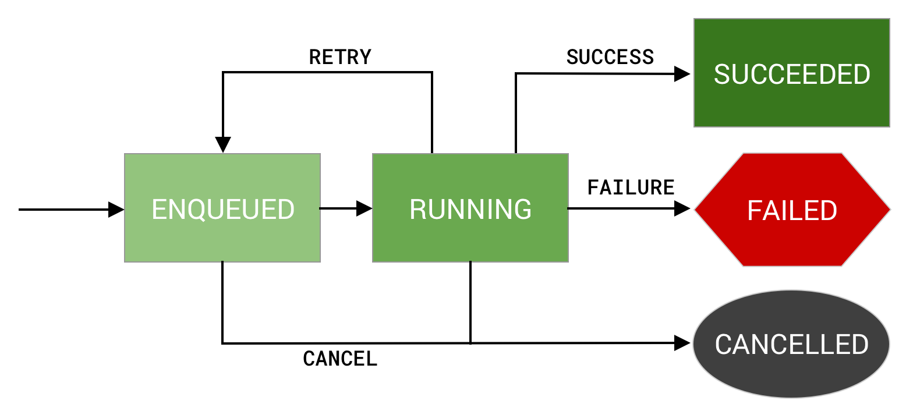
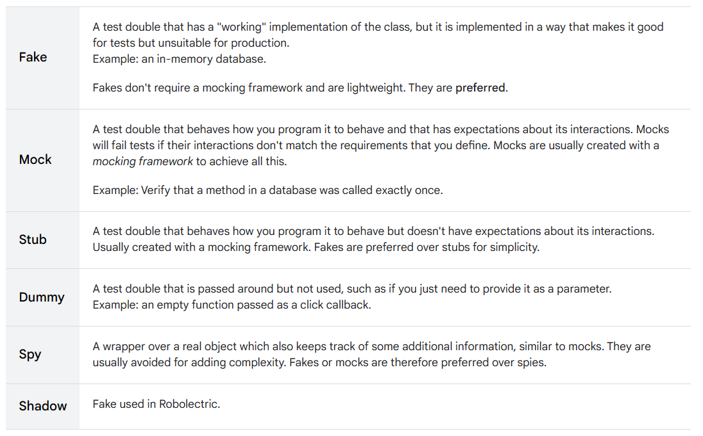

# Android View System Practice

## 1. DataBinding

### 1.1. Databinding을 활용한 간단한 예시

* TextView, EditText, Button으로 구성

  * EditText에 이름을 입력하고 Button을 클릭 시, TextView에 인사를 띄우는 작업

* findViewById()란?
  
  * xml에서 정의한 View를 Activity/Fragment에서 참조하기 위하여 사용하는 메소드
  
  * xml에서 정의한 View의 Id를 활용하여 접근
    `val button = findViewById<Button>(R.id.submit_button)`
  
  * 동작 원리
  
    * findViewById() 함수를 활용하여 View에 대한 참조를 실시할 때
    
      * 안드로이드 시스템은 런타임에 View들의 계층구조 속에서 해당 View를 찾아낸다
      
      * 문제점
        * 애플리케이션의 규모가 커질수록 무수히 많은 Layout과 View가 존재하게 되는데, 런타임동안 View의 거대한 계층구조 속에서 원하는 View를 찾는 것은 비효율적
        * 즉, 애플리케이션의 규모가 커질수록 해당 View를 찾는 데 많은 시간과 자원이 소모되는 만큼 성능 저하가 필연적
        
* DataBinding이란?

  * 동작 원리

    * "레이아웃" 단위로, 각 View들에 대한 참조를 담고 있는 Binding Object를 생성

    * Binding Object가 생성되면
    
      * 애플리케이션의 모든 컴포넌트들은 Binding Object를 통해 View와 Data에 접근 가능
      
    * 이러한 방식은 안드로이드 시스템이 View를 찾기 위하여 계층구조를 살펴볼 필요가 없도록 한다.
    
      * 따라서, findViewById를 사용할 때에 비하여 애플리케이션의 성능을 대폭 향상시킬 수 있게 된다.
      * 뿐만 아니라, findViewById에 비하여 더욱 코드를 간결하게 만들며, 읽기 쉽고 유지보수성을 높인다.
      * DataBinding 방식의 Data Binding Object 생성은 compile time에 이뤄진다는 것이 큰 장점이다.
      
  * 사용 방식
    
  1. gradle에서 dataBinding을 enable시킨다.
  
    ```
    android {
      // ...
      dataBinding {
        enabled = true
      }
    }
    ```
  
  2. xml 레이아웃에 대한 Binding Class를 생성하기 위하여, 레이아웃의 모든 요소들을 <layout> 태그로 감싸야 한다.

    * 이 과정에서, namespace declaration은 가장 바깥의 태그에 존재해야 함에 유의  

    ```
    <?xml version="1.0" encoding="utf-8"?>
    <layout
      xmlns:android="http://schemas.android.com/apk/res/android"
      xmlns:app="http://schemas.android.com/apk/res-auto"
      xmlns:tools="http://schemas.android.com/tools">
  
      <androidx.constraintlayout.widget.ConstraintLayout
          android:layout_width="match_parent"
          android:layout_height="match_parent"
          tools:context=".MainActivity">
  
          <TextView
              android:id="@+id/tv_greeting"
              android:layout_width="wrap_content"
              android:layout_height="wrap_content"
              app:layout_constraintStart_toStartOf="parent"
              app:layout_constraintEnd_toEndOf="parent"
              app:layout_constraintTop_toTopOf="parent"
              app:layout_constraintBottom_toTopOf="@id/edit_name"/>
  
          <EditText
              android:id="@+id/edit_name"
              android:layout_width="match_parent"
              android:layout_height="wrap_content"
              android:layout_marginStart="50dp"
              android:layout_marginEnd="50dp"
              app:layout_constraintBottom_toTopOf="@id/btn_submit"
              android:layout_marginBottom="20dp"
              android:autofillHints="fill here"
              android:inputType="text" />
  
          <Button
              android:id="@+id/btn_submit"
              android:layout_width="wrap_content"
              android:layout_height="wrap_content"
              app:layout_constraintTop_toTopOf="parent"
              app:layout_constraintBottom_toBottomOf="parent"
              app:layout_constraintStart_toStartOf="parent"
              app:layout_constraintEnd_toEndOf="parent"
              android:text="@string/submit"/>
  
      </androidx.constraintlayout.widget.ConstraintLayout>
    </layout>
  
    ```
  
    * layout 태그로 감싼 레이아웃의 경우, 안드로이드 DataBinding 라이브러리는 Binding Object를 생성한다.
  
      * 이 과정에서 Binding Object의 이름은 다음과 같이 생성된다.
      
        * xml 파일의 이름 : activity_main -> Binding Object 이름 : ActivityMainBinding
        * underscore를 기준으로 각 단어의 첫 글자를 대문자로 만들고, underscore를 제거한 후 뒤에 Binding을 붙임

  3. Activity 클래스에서 databinding object 생성하여 사용

  * binding object에 대한 Reference Variable 생성하기
  
    `private lateinit var binding: ActivityMainBinding`

  * setContentView()란?
  
    * 스크린에 레이아웃을 렌더링하기 위한 함수
    
    * 개발자가 매개변수로 삽입한 xml 레이아웃 파일에 기반하여, 레이아웃 내부의 View들은 inflate되고 렌더링될 것
    
    * databinding에서는 이 함수를 사용하지 않고, binding object를 활용하여 같은 작업을 효율적으로 수행
    
      * DataBindingUtil의 setContentView() 함수를 사용
  
  * Databinding Object를 생성(앞에서 정의한 lateinit 변수를 초기화)
  
    * 매개변수 : activity, layout
  
      `binding = DataBindingUtil.setContentView(this, R.layout.activity_main)`
  
  * 이렇게 되면, DataBinding Object는 해당 xml(여기서는 activity_main)의 모든 View들에 대해 '속성'으로 참조 가능
  
    * dot operator로 참조 가능 => `binding.viewId`
    
    * property name이 만들어지는 원리는 DataBinding Object의 이름의 원리와 동일하지만, 첫 글자는 소문자라는 차이점이 있음
    
    * 주의점 : xml 파일에서 id를 camal case로 정의한다면, DataBinding Object는 해당 뷰를 속성으로 받아들이지 못한다. 따라서 반드시 snake case로 지정
    
* 최종 코드

    ```
    class MainActivity : AppCompatActivity() {

        private lateinit var binding: ActivityMainBinding
    
        override fun onCreate(savedInstanceState: Bundle?) {
            super.onCreate(savedInstanceState)
            binding = DataBindingUtil.setContentView(this, R.layout.activity_main)
    
            val button = binding.btnSubmit
    
            button.setOnClickListener {
                displayGreeting(binding.editName.text)
            }
        }
    
        private fun displayGreeting(text: Editable) {
            binding.apply {
                tvGreeting.text = text
            }
        }
    }
    ```
  
### 1.2. Databinding을 활용한 객체 바인딩
* 많은 경우에 UI에 특정 정보를 띄우기 위하여 다음과 같은 방법을 사용

  * 로컬 데이터베이스
  * 원격 API

* 이 두 경우의 공통점은, Object 형태로 데이터를 받는다는 것이다.

* DataBinding을 활용한다면, 이렇게 받은 정보들을 직접적으로 레이아웃(xml)으로 전달시킬 수 있다.

* 그렇게 함으로써 코드량을 줄일 수 있을 뿐만 아니라, 코드의 가독성도 높일 수 있다.

* ObjectBindingActivity.kt

  * 서버로부터 Student라는 객체 형태로 데이터를 GET 한다고 가정 => getStudent()
  
  * 1.1.에서 알아보았던 대로라면, binding 객체에서 직접 view들을 참조하여 각 view들의 값을 설정해주는 작업을 수행해야 한다.
  
  ```
  class ObjectBindingActivity : AppCompatActivity() {
      private lateinit var binding: ActivityObjectBindingBinding
      override fun onCreate(savedInstanceState: Bundle?) {
          super.onCreate(savedInstanceState)
          binding = DataBindingUtil.setContentView(this, R.layout.activity_object_binding)
          
          val student = getStudent()
          
          binding.apply { 
              tvName.text = student.name
              tvEmail.text = student.email
          }
      }
  
      private fun getStudent(): Student {
          return Student(1, "Alex", "alex@gmail.com")
      }
  }

  data class Student(
      val id: Int,
      val name: String,
      val email: String
  )
  ```
  
  * 하지만, 가져온 객체의 property의 값을 하나하나 이용하여 binding 객체의 property에 일일이 값을 설정해주는 것은 매우 귀찮은 일
  
  * DataBinding을 활용한다면, Student 객체를 직접적으로 xml에 바인딩할 수 있음 => viewBinding 대신 dataBinding을 활용하는 것의 가장 큰 강점
  
* Data class를 비롯한 객체를 직접 xml에 바인딩 하는 방법

1. 레이아웃에서 특정 객체에 대한 참조를 추가

* xml 파일에서 <layout> 태그 안에 <data> 태그를 추가

  * 여기 안에서 레이아웃에서 사용할 객체들을 정의 => <variable>
  
  * variable -> 특정 객체를 변수로 사용하기 위함
  
    * name -> 변수명에 비유 가능
    
    * type -> 자료형에 비유 가능
      * package name을 포함한 경로
  
  ```
  <data>
        <variable
            name="student"
            type="com.practice.view_system_practice.Student" />
  </data>
  ```

2. 이를 활용하여 Student의 property를 직접적으로 View에 넣을 값으로 할당 가능

* name을 통하여 참조

  ```
  <layout xmlns:android="http://schemas.android.com/apk/res/android"
    xmlns:app="http://schemas.android.com/apk/res-auto">

    <data>
        <variable
            name="student"
            type="com.practice.view_system_practice.Student" />
    </data>

    <androidx.constraintlayout.widget.ConstraintLayout xmlns:tools="http://schemas.android.com/tools"
        android:layout_width="match_parent"
        android:layout_height="match_parent"
        tools:context=".ObjectBindingActivity">

        <TextView
            android:id="@+id/tv_name"
            android:layout_width="wrap_content"
            android:layout_height="wrap_content"
            android:text="@{student.name}"
            app:layout_constraintBottom_toBottomOf="parent"
            app:layout_constraintEnd_toEndOf="parent"
            app:layout_constraintStart_toStartOf="parent"
            app:layout_constraintTop_toTopOf="parent" />

        <TextView
            android:id="@+id/tv_email"
            android:layout_width="wrap_content"
            android:layout_height="wrap_content"
            android:text="@{student.email}"
            app:layout_constraintEnd_toEndOf="parent"
            app:layout_constraintStart_toStartOf="parent"
            app:layout_constraintTop_toBottomOf="@id/tv_name" />

    </androidx.constraintlayout.widget.ConstraintLayout>
  </layout>
  ```
  
3. Activity 파일에서 DB/API로부터 받은 student 객체를 xml 레이아웃으로 보내기 위한 작업을 수행

* BindingObject.xml에서 정의한 variable의 name 형태로
  ```
  class ObjectBindingActivity : AppCompatActivity() {
      private lateinit var binding: ActivityObjectBindingBinding
      override fun onCreate(savedInstanceState: Bundle?) {
          super.onCreate(savedInstanceState)
          binding = DataBindingUtil.setContentView(this, R.layout.activity_object_binding)
          binding.student = getStudent()
  
      }
  
      private fun getStudent(): Student {
          return Student(1, "Alex", "alex@gmail.com")
      }
  }
  
  data class Student(
      val id: Int,
      val name: String,
      val email: String
  )
  ```
  
-- -- --

## 2. ViewModel

### 2.1. ViewModel을 왜 사용해야 하는가?

```
class VmBasicActivity : AppCompatActivity() {
    private lateinit var binding: ActivityVmBasicBinding
    private var count = 0
    override fun onCreate(savedInstanceState: Bundle?) {
        super.onCreate(savedInstanceState)
        binding = DataBindingUtil.setContentView(this, R.layout.activity_vm_basic)

        binding.apply {
            tvCount.text = count.toString()
            btnCount.setOnClickListener {
                count++
                tvCount.text = count.toString()
            }
        }
    }
}
```

* 이 코드의 문제점 => User Experience를 크게 해친다.

  * Configuration Change를 고려하지 않았다.
  
    * 화면을 회전하거나, 키보드 변경, 언어를 변경하거나, 멀티윈도우를 실행시키거나, 다크모드로 바꾸는 등의 동작
    
    * 액티비티는 Destroy 되고 다시 Create된다.
    
    * 이 과정에서, Configuration Change가 발생하기 이전의 값을 온전히 보전하지 못하고 초기 상태로 돌아가는 문제가 발생
    
  * 따라서 이러한 Configuration Change가 발생하여도 Activity의 생명주기에 관계 없이 독립적으로 동작하는 곳이 필요


* 이를 해결하기 위하여, ViewModel을 사용한다.

  * A Model class for View - Activity/Fragment에 속하는 값들을 보관하기 위한 목적으로 사용
  
  * UI와 관련된 데이터들을 두고 관리하기 위한 목적으로 사용
  
  * 주로 하나의 Activity/Fragment 당 하나의 ViewModel을 활용. 다만 하나의 ViewModel를 여러 개의 Activity/Fragment들과 공유하기도 함
  
  * Activity가 Create되고 나서 메모리로부터 Clear(ViewModel의 onClear())될 때까지 유지된다.
  
    * Activity가 Destroy 되어도 메모리에 유지된다.

* cf) AAC의 ViewModel과 MVVM ViewModel의 차이점은?

  * AAC ViewModel은 Activity/Fragment 클래스의 생명주기에 관계 없이(ViewModel이 onClear되지 않는 한) 지속되어야 할 데이터를 담기 위해 사용되는 추상 클래스
    * configuration change에도 Activity/Fragment에서 사용할 데이터를 유지하기 위한 목적이 큼
    * AAC의 ViewModel은 하나의 View에 대해서 종속(싱글톤)
      * 그렇다고 이것이 하나의 View에 한 종류의 ViewModel만 있어야 한다는 의미는 아님
      * 한 종류의 ViewModel이 하나의 액티비티에 존재할 때, 적어도 한 액티비티 내에서는 Singleton으로 존재해야 한다는 의미.
      
  * MVVM의 ViewModel은 Model과 View 사이에서 데이터를 관리하고 바인딩 하는 역할
    * 비즈니스 로직을 담당
      * viewmodel은 view와 model을 소유. model을 소유하면서 갱신도 가능
        * 비즈니스 로직과 UI 로직을 분리하기 위한 목적이 가장 크다.
        * 데이터 처리에 관한 로직들은 ViewModel에서 담당하고,
        * Ui 계층에서는 Data의 변화를 ViewModel로부터 통지받아(observe) 통지받은 대로 값을 바꿀 수 있도록 한다.
        * 이렇게 해서 UI에서는 데이터 처리에는 관심을 가지지 않고 UI 작업에만 관심을 가질 수 있도록 함
    * ViewModel에서 특정 View에 대한 참조가 이뤄져서는 안된다.
      * 하나의 ViewModel은 여러 View에 대해서 사용될 수 있어야 하기 때문
      
  * AAC의 ViewModel을 MVVM의 ViewModel처럼 사용하려면?
    * DataBinding과 LiveData를 사용하는 것이 가장 일반적인 방법
      * UI에서 사용할 ViewModel 내부의 Data의 변화에 대한 사항을 observe하여, 그 값이 바뀌면 그에 따라 UI에 반영할 수 있게 됨

### 2.2. ViewModel의 사용법

1. dependency 추가
```
    def lifecycle_version = "2.5.1"

    // ViewModel
    implementation "androidx.lifecycle:lifecycle-viewmodel-ktx:$lifecycle_version"
```

2. ViewModel을 확장하는 클래스를 만든다.

cf) ViewModel이 아닌 AndroidViewModel을 확장하는 경우가 있음

* AndroidViewModel의 경우, Application 인스턴스를 생성자에 추가

* ViewModel 코드에서 context를 사용해야 하는 경우 유용하다.

```
import androidx.lifecycle.ViewModel

class VmBasicViewModel: ViewModel() {
    private var count = 0

    // 현재의 값을 리턴하기 위한 function
    fun getCurrentCount(): Int {
        return count
    }

    // 현재의 값에서 1을 추가하고 그 값을 return하는 function
    fun getUpdatedCount(): Int {
        return ++count
    }
}
```

3. Activity 코드에 viewModel 인스턴스를 초기화 시킨다.

* ViewModelProvider(context).get(ViewModel클래스명)를 이용

```
viewModel = ViewModelProvider(this).get(클래스명::class.java)
```

* 다른 방법 : ktx를 이용한다.

  * 액티비티와 프래그먼트를 위한 dependency 추가
  
  ```
  implementation 'androidx.activity:activity-ktx:1.3.1'
  implementation 'androidx.fragment:fragment-ktx:1.3.1'
  ```
  
  * 액티비티에서 인스턴스 초기화
  
  ```
  private val viewModel: MainActivityViewModel by viewModels()
  ```

* 최종 코드

```
class VmBasicActivity : AppCompatActivity() {
    private lateinit var binding: ActivityVmBasicBinding
    private lateinit var viewModel: VmBasicViewModel

    override fun onCreate(savedInstanceState: Bundle?) {
        super.onCreate(savedInstanceState)
        binding = DataBindingUtil.setContentView(this, R.layout.activity_vm_basic)
        viewModel = ViewModelProvider(this).get(VmBasicViewModel::class.java)
    
        binding.apply { 
            tvCount.text = viewModel.getCurrentCount().toString()
            btnCount.setOnClickListener { 
                tvCount.text = viewModel.getUpdatedCount().toString()
            }
        }

    }
}

```

* ViewModel에 Constructor를 넣어야 하는 경우라면?

  * ViewModelFactory 클래스를 이용해야 함
  
  * Factory 클래스를 하나 만들고, 이 클래스가 ViewModelProvider.Factory를 구현하도록 해야 한다.
  
  ```
  class VmAccViewModelFactory: ViewModelProvider.Factory {
  
  }
  ```
  
  * 이렇게 하면, viewmodel에 생성자를 추가 가능
  
  ```
  class VmAccViewModel(startingTotal: Int): ViewModel() {
    private var count = 0

    init {
        count = startingTotal
    }
    
    fun getCountData(): Int {
        return count
    }

    fun getUpdatedData(num: Int) {
        count += num
    }
  }
  ```

  * ViewModel에서 추가한 생성자를 사용하기 위하여, Factory 클래스의 생성자로 ViewModel과 같은 생성자를 추가하고, create 메소드를 override 해야 한다.
  * 
  ```
  class VmAccViewModelFactory(private val startingTotal: Int): ViewModelProvider.Factory {

    // create function to return the viewModel
    override fun <T : ViewModel> create(modelClass: Class<T>): T {
        if (modelClass.isAssignableFrom(VmAccViewModel::class.java)) {
            return VmAccViewModel(startingTotal) as T
        }
        throw IllegalArgumentException("unknown view model class")
    }
  }  
  ```
  
  * Activity에서 Factory Instance를 만들어 ViewModel을 사용한다.
  ```
  viewModelFactory = VmAccViewModelFactory(15)
  viewModel = ViewModelProvider(this, viewModelFactory).get(VmAccViewModel::class.java)
  ```

### 2.3. ViewModel의 onCleared()는 언제 호출되는가?
* ViewModel이 더 이상 필요해지지 않는 시점에 호출된다.
  * 앱이 백그라운드 상태가 되고 시스템 메모리 관리 상의 이유로 앱 프로세스가 kill될 때
  * 또한 유저가 명백하게 액티비티 상에서 finish() 코드를 호출하거나 뒤로가기 버튼을 누를 때 때에도 onCleared()가 호출

-- -- --
## 3. LiveData

### 3.1. LiveData의 용도

* LiveData란?

  * Lifecycle을 인식하는 Observable한 Data Holder 클래스
  * 생명주기를 인식한다는 것이 특징 : 생명주기 동안에만 observer에게 변경되는 값을 알려줌
    * 이것의 큰 장점으로 작용. 생명주기를 인식하기 때문에 RxJava와 같은 다른 반응형 프로그래밍을 위한 라이브러리를 사용할 때 activity/fragment/service의 observer를 별도로 처리 할 필요가 없어진다는 것
  * 안드로이드에서 Lifecycle과 관련된 세 가지의 클래스들 => 아래의 클래스들은 LiveData Object에 대한 관찰자가 될 수 있음
    * Activity
    * Fragment
    * Service

* Activity/Fragment에서 ViewModel 상의 데이터를 관찰하기 위한 코드를 작성할 수 있는데, 바로 LiveData를 이용하는 것이다.

* 만약 ViewModel 상의 데이터에 변화가 발생하였다면, LiveData를 활용하면 Activity나 Fragment의 UI를 자동으로 업데이트 할 수 있다.

  * 수동으로 특정 view를 참고하여 직접 값을 설정할 필요가 없어짐 : up-to-date data 유지

* 생명주기를 다루기 위한 코드들을 수동으로 작성할 필요가 없다.
  * 관련된 생명주기를 가진 클래스가 destroy된다면, 스스로 clean up 작업을 수행
  * 따라서, 메모리 누수 여부를 고려하지 않아도 됨
  
### 3.2. LiveData 사용하기

1. ViewModel에서는 Activity/Fragment에서 관찰할 변수를 MutableLiveData와 LiveData로 정의한다.

cf) LiveData vs MutableLiveData
* LiveData 객체 내부에 있는 데이터는 읽기만 가능하며, 수정이 불가능하다.
* MutableLiveData는 LiveData의 하위 클래스로, 데이터를 바꾸는 것이 가능하다.

2. MutableLiveData에 값을 할당해준다.

* 방법
  * mutableLiveData명.value = 값

* 그 결과, viewModel에서는 더 이상 데이터를 얻어오기 위한 함수가 필요 없어진다.

```
class VmAccViewModel(startingTotal: Int): ViewModel() {
    private var _count = MutableLiveData<Int>()
    val count = _count.value

    init {
        _count.value = startingTotal
    }

/*    fun getCountData(): Int {
        return count
    }*/

    fun updatedData(num: Int) {
        _count.value = _count.value?.plus(num)
    }
}
```

3. 해당 LiveData를 사용할 Activity/Fragment/Service에서, LiveData를 observe 하기 위한 코드를 작성한다.

```
viewModel.count.observe(this, Observer { 
    binding.tvCount.text = it.toString()
})
```
여기서...
* 첫 번째 parameter : lifecycleOwner -> 액티비티에 대한 라이프사이클을 감지해야 하므로 액티비티 context를 집어넣음
* 두 번째 parameter : Observer 클래스 정의 -> 값이 바뀌는 것을 관찰한 순간 해야 할 일을 onChanged block 안에 정의


### 3.3. viewModel을 xml layout에 직접 연결하기

* 버튼을 클릭하였을 때의 동작을 Activity 코드에서 정의할 필요가 없고, xml에서 정의

  * Activity에서 button에 대한 onClickListener를 설정할 필요가 없다.
  * databinding을 활용하면 된다.

1. activity layout에서 viewModel을 활용하기 위하여 data를 정의
```
    <data>
        <variable
            name="viewModel"
            type="com.practice.view_system_practice.VmAccViewModel" />
    </data>
```

2. activity에서 xml에서 사용할 viewModel을 할당해주기
```
binding.viewModel = viewModel
```

3. layout xml 파일에서 특정 뷰(여기서는 버튼)에 대한 onClick 속성을 정의한다.

  * 방법

    * Button에 onClick 속성을 추가한다.
    * @와 {}를 활용
    * {} 안에는 익명의 함수를 arrow function으로 정의한다.
    ```
    <Button
            android:id="@+id/btn_count"
            android:layout_width="wrap_content"
            android:layout_height="wrap_content"
            app:layout_constraintStart_toStartOf="@id/tv_count"
            app:layout_constraintTop_toBottomOf="@id/tv_count"
            android:onClick="@{() -> viewModel.updatedData()}"/>
    ```
    
* 이렇게 함으로써, 최종 코드는 다음과 같이 button에 대한 onClickListener를 제거할 수 있다.
```
class VmAccActivity : AppCompatActivity() {
    private lateinit var binding: ActivityVmAccBinding
    private lateinit var viewModel: VmAccViewModel
    private lateinit var viewModelFactory: VmAccViewModelFactory
    override fun onCreate(savedInstanceState: Bundle?) {
        super.onCreate(savedInstanceState)
        binding = DataBindingUtil.setContentView(this, R.layout.activity_vm_acc)

        viewModelFactory = VmAccViewModelFactory(15)
        viewModel = ViewModelProvider(this, viewModelFactory).get(VmAccViewModel::class.java)
        binding.viewModel = viewModel

        // live data
        viewModel.count.observe(this) {
            binding.tvCount.text = it.toString()
        }
    }
}
```
    
* 주의 : 이것을 사용하기 위해서는 gradle 버전이 2.0 이상이어야 한다.

### 3.4. LiveData Object를 layout xml에 직접 연결하기

* 이것을 활용하면, activity 단에서 특정 LiveData를 Observe할 필요가 없어진다.
* xml에서 viewModel의 LiveData를 직접 읽어오는 작업을 진행하면 된다.
* 만약 자료형을 바꾸고 싶다면, 바꾸고 싶은 자료형.valueOf(이전 자료형)을 넣으면 된다.

```
<TextView
    android:id="@+id/tv_count"
    android:layout_width="wrap_content"
    android:layout_height="wrap_content"
    android:layout_marginStart="36dp"
    android:layout_marginTop="200dp"
    android:text="@{String.valueOf(viewModel.count)}"
    android:textSize="52sp"
    app:layout_constraintStart_toStartOf="parent"
    app:layout_constraintTop_toBottomOf="@id/et_count" />
```

* 이 작업은 viewModel의 livedata를 직접 사용한 것으로, activity 코드에서 진행하였던 observe() 함수를 사용하는 과정이 포함되어 있지 않는다.
  * 즉, lifecycle owner를 지정해줌으로써 livedata가 lifecycle을 인식할 수 있도록 하는 과정이 생략되어있음.
  * LiveData는 항상 생명주기와 관련되어있기 때문에, viewModel object에 대한 lifecycle owner를 설정해주는 것이 반드시 필요

```
class VmAccActivity : AppCompatActivity() {
    private lateinit var binding: ActivityVmAccBinding
    private lateinit var viewModel: VmAccViewModel
    private lateinit var viewModelFactory: VmAccViewModelFactory
    override fun onCreate(savedInstanceState: Bundle?) {
        super.onCreate(savedInstanceState)
        binding = DataBindingUtil.setContentView(this, R.layout.activity_vm_acc)
        // viewmodel 생성자가 없는 경우
        // viewModel = ViewModelProvider(this).get(VmAccViewModel::class.java)

        // viewmodel 생성자가 있는 경우
        viewModelFactory = VmAccViewModelFactory(15)
        viewModel = ViewModelProvider(this, viewModelFactory).get(VmAccViewModel::class.java)
        binding.viewModel = viewModel
        // *** viewmodel에서 사용할 livedata들이 생명주기를 인식할 수 있도록 하는 작업
        binding.lifecycleOwner = this
    }
}
```

### 3.5. 양방향 DataBinding

* 지금까지의 내용을 바탕으로, LiveData를 활용하면 실시간으로 변경되는 값을 자동적으로 UI에 값을 변경할 수 있음을 알게 되었다.

* 양방향 DataBinding?

  * 앞에서는 Object의 값이 변경될 때 UI의 값이 변경되는 것을 다루었음(단방향 데이터 바인딩)
  * 양방향 DataBinding은 여기에 더하여 UI의 값이 변경될 때, 연관된 Object의 값을 변경하기 위해 사용
  
* 양방향 데이터 바인딩을 구현하기 위하여, EditText를 하나 구현

  * 주의 : viewModel에서 livedata를 정의할 때 MutableLiveData로 정의해야 하며, 해당 MutableLiveData 변수가 private이 되어서는 안된다.
  `val userName = MutableLiveData<String>()`

  * EditText의 값에 따라 자동적으로 viewModel의 LiveData값이 변경되도록 하는 방법
  ```
  <EditText
      android:layout_width="match_parent"
      android:layout_height="wrap_content"
      android:textSize="36sp"
      app:layout_constraintBottom_toTopOf="@id/tv_count"
      android:text="@{viewModel.userName}" />
  ```
  
  * 이러한 방식으로 단방향 데이터 바인딩과 같은 방법을 사용하면, edittext의 변화가 livedata에 반영되지 않는다.

  * 입력 사항을 livedata에 반영한다는 의미에서, **@={}** 사인을 사용한다.

  ```
  <EditText
    android:layout_width="match_parent"
    android:layout_height="wrap_content"
    android:textSize="36sp"
    app:layout_constraintBottom_toTopOf="@id/tv_count"
    android:text="@={viewModel.userName}" />
  ```
  
-- -- --

## 4. Lifecycle

### 4.1. Activity Lifecycle Transition Example

* 어떤 Activity를 띄울 때(메모리에 올라갈 때),
  * onCreate -> onStart -> onResume 순으로 빠르게 호출
  * 액티비티가 Foreground에서 아무런 제약없이 화면이 보이고 동작하는 동안은 Activity Running 상태
  * 그러다가, 다른 Activity가 띄워지게 되면, 이전 Activity는 일부분 이상이(여기서는 전체) 시야에서 사라지게 되므로 onPause가 호출
  * 그 후 다른 Activity의 onCreate -> onStart -> onResume 순으로 호출되고 나서야 완전히 이전 액티비티는 Foreground에서 사라진 것을 확신할 수 있어 이 시점에서 onDestroy가 호출
    * **onStop() 상태에서는 UI가 보이지 않을 뿐, 여전히 액티비티는 메모리에 남아있다는 것에 주의해야 한다.**
    
  * 액티비티에서 onDestroy()가 호출되는 경우
    * 뒤로가기 버튼을 누르거나
    * finish()를 호출하거나
    * Configuration Change가 발생하였을 경우
      * 특히, Configuration Change가 발생하는 경우, onDestroy()까지 호출된 후 다시 onCreate()부터 호출된다.
    
  * 따라서, 새로 호출한 Activity에서 뒤로가기 버튼을 누르는 경우, 두 번째로 호출한 Activity는 onPause() 상태로 전이 되었다가,
    * 이전 Activity가 onStop() 상태에서 다시 호출되었으므로 onRestart -> onStart -> onResume으로 다시 Running 상태로 들어가고,
    * 그때 이후에 두번째로 호출한 Activity는 onStop -> onDestroy까지 호출됨으로써 메모리로부터 해제된다.

### 4.2. Fragment Lifecycle

* fragment : 액티비티(UI)에서 일부분 재사용될 수 있는 장소 => sub activity component
* 액티비티에서처럼, 별도의 레이아웃과 생명주기를 가지며 사용자와 상호작용도 가능
  * 하지만, Fragment는 독립적으로 존재할 수 없다는 점이 가장 큰 특징
  * 반드시 Host Activity 혹은 다른 Fragment에 속해 있어야 한다.

* Fragment의 lifecycle 중, onCreateView에서 ui 관련 객체들을 초기화하는 작업들(binding, viewmodel)과 클릭 이벤트 등을 정의한다.
  * onCreate()에서는 Fragment가 생성되는 때이지, Fragment에 속해있는 View들이 생성되는 때가 아니기 때문
  * Fragment와 Fragment의 View들의 lifecycle은 별도임을 유의

-- -- --

## 5. Navigation

### 5.1. Jetpack Navigation

* jetpack navigation architecture components library
  * 앱에서 다뤄야 할 navigation을 위해 필요한 모든 것들을 다룰 수 잇는 도구들이 마련되어 있어 종전의 방식보다 쉽게 navigation 구현 가능

* 최근의 안드로이드 앱개발의 트렌드 : **Single Activity, Multiple Fragments**
  * Navigation Architecture Component를 사용함으로써, 하나의 빈 Activity를 Basement로 사용
  * 다른 화면들은 모두 Fragment로 구현

* Navigation 3대 구성요소
  * NavigationGraph
    * navigation과 관련된 모든 정보들을 담고 있는 xml 파일
    * Navigation Graph를 활용하여, 한 xml 파일에서 navigation 관련 task들을 관리 가능
  * NavHost(Fragments)
    * Navigation Graph를 가지고 있는 Container로, Activity에서 관리.
    * 일종의 비어있는 Container 역할
    * Container 내부에 Navigation Graph 경로의 설정에 따라 Fragment를 갈아끼우거나 추가하거나 제거하는 식으로 화면을 전환
  * NavController
    * Navigation Graph에 추가한 destination들 간 navigation을 관리하기 위한 클래스
    * navigate() 등의 함수를 활용하여 화면 이동을 지시

### 5.2. Navigation Component 사용하기

1. dependency로 다음과 같이 추가

```
  def nav_version = "2.5.3"

  // Kotlin
  implementation "androidx.navigation:navigation-fragment-ktx:$nav_version"
  implementation "androidx.navigation:navigation-ui-ktx:$nav_version"
```

2. Fragment 간 Data를 주고받고자 할 때, safe args를 사용해야 함. 따라서 아래의 dependency도 추가

* project 수준 build.gradle
```
buildscript {
    ext {
        nav_version = '2.5.3'
    }
    dependencies {
        classpath "androidx.navigation:navigation-safe-args-gradle-plugin:$nav_version"
    }
}
```

* module 수준
```
plugins {
    id 'androidx.navigation.safeargs.kotlin'
}
```

3. Navigation Graph 생성

* Navigation Graph는 애플리케이션에서 표출해야 할 모든 화면들(Fragment)을 표출하며
* 어떻게 유저가 각 스크린에 도달하는지에 대한 정보를 담고 있음
* 한 파일을 활용하여 navigation 관련 action들을 관리할 수 있도록 한다.

* Navigation Editor에서 생성 가능(xml 코드로도 확인 가능하며, 시각적으로도 확인 가능)
  * Android Studio 좌측의 Resource Manager > Navigation 탭 > 좌측 상단의 + 버튼
  * Android Studio가 res 폴더 내부에 navigation 폴더를 생성하여 그 안에 navigation graph xml 파일을 생성한다.
  * 파일명은 nav_graph로 한다.

4. Navigation Host Fragment 생성

> navigation graph를 생성하고, 디자인 모드에서 좌측 상단의 Host 탭을 보면 다음과 같은 문구를 확인 가능
> "No NavHostFragments Found"

* Navigation Graph를 Host하고 화면들을 담기 위한 Fragment
* Navigation Graph만을 생성해서 화면들의 이동을 구현할 수는 없다. 어떻게 이동할 지만 정해놓았기 때문.
  * Navigation Graph는 Host Fragment를 통해 다른 스크린과 상호작용
* 이동할 화면들을 Host, 즉 Container 역할을 할 Fragment가 별도로 필요한데 이것이 바로 Navigation Host Fragment
  * Host Fragment의 고정된 크기 안에서 여러 화면들을 전환

* Basement로 삼을 Activity xml 파일로 이동하여, NavHostFragment를 추가한다.
  * FragmentContainerView 태그를 활용
  * activity 내부에 fragment를 생성하고, 그 fragment를 navGraph와 연결(navGraph 속성 활용)
  ```
  <androidx.fragment.app.FragmentContainerView
       android:id="@+id/nav_host_fragment"
       android:name="androidx.navigation.fragment.NavHostFragment"
       android:layout_width="match_parent"
       android:layout_height="match_parent"
       app:defaultNavHost="true"
       app:navGraph="@navigation/nav_graph" />
  ```
  * 그 결과, nav_graph.xml로 이동하면 Host로 activity가 추가된 것을 확인 가능

5. Nav Graph에 화면(Fragment)들을 추가

* 좌측 상단의 + 버튼 > fragment 추가
* 첫 번째 화면을 추가하면, graph에 화면이 나타나고 fragment명 좌측에는 홈 모양의 아이콘이 함께 나타남
  * start destination이라는 의미로, 이는 쉽게 바꿀 수 있음(위의 홈 모양 버튼을 통해)
  * 첫번째 Fragment인 HomeFragment에 EditText와 Button을 넣고, Databinding을 위하여 다음과 같이 설정
    * fragment_home.xml
    ```
    <?xml version="1.0" encoding="utf-8"?>
    <layout xmlns:android="http://schemas.android.com/apk/res/android"
    xmlns:tools="http://schemas.android.com/tools"        
    xmlns:app="http://schemas.android.com/apk/res-auto">
    <data>
    
        </data>
        <androidx.constraintlayout.widget.ConstraintLayout 
            android:layout_width="match_parent"
            android:layout_height="match_parent"
            tools:context=".navigation.HomeFragment">
    
            <EditText
                android:id="@+id/et_text"
                android:layout_width="match_parent"
                android:layout_height="wrap_content"
                app:layout_constraintTop_toTopOf="parent"
                app:layout_constraintStart_toStartOf="parent"
                app:layout_constraintEnd_toEndOf="parent"
                app:layout_constraintBottom_toTopOf="@id/btn_submit"
                android:layout_marginHorizontal="36dp"
                android:textSize="36sp" />
    
            <Button
                android:id="@+id/btn_submit"
                android:layout_width="wrap_content"
                android:layout_height="wrap_content"
                app:layout_constraintStart_toStartOf="parent"
                app:layout_constraintEnd_toEndOf="parent"
                app:layout_constraintTop_toBottomOf="@id/et_text"
                app:layout_constraintBottom_toBottomOf="parent"
                android:text="@string/submit"/>
    
    
    
        </androidx.constraintlayout.widget.ConstraintLayout>
    </layout>
    ```
    
    * HomeFragment.kt
    ```
    class HomeFragment : Fragment() {
        private lateinit var binding: FragmentHomeBinding
            override fun onCreateView(
                inflater: LayoutInflater, 
                container: ViewGroup?,savedInstanceState: Bundle?
            ): View? {
                binding = DataBindingUtil.inflate(inflater, R.layout.fragment_home, container, false)
                return binding.root
            } 
    }
    ```
    
  * 같은 방식으로, 다른 fragment들도 만든다.

6. Fragment 간 이동을 구현한다.

* Fragment간 이동은 <action>으로 구현한다!

* navigation graph xml 파일을 text mode로 전환 시,
  * **<navigation>** 태그가 가장 상위에 존재
    * 여기서 startDestination이 정의됨을 알 수 있음
      * 하위 <fragment>의 id로 정의
  * **<navigation>** 태그 내부에는, **<fragment>** 태그들이 존재
    * base activity xml 파일에서 정의한 <FragmentContainerView> 내부에 나타날 수 있는 화면들을 정의한 것
    
* 하지만, 내부에 **<fragment>**만 정의한다고 해서, 화면 간 이동을 구현할 수는 없다.
  * 화면에서 다른 화면으로 이동시키는 것은 <action>으로 정의한다.

* 방법

  * design 모드로 이동하여,
    * 시작 fragment의 오른쪽 circle을 끌어당겨 도착 fragment에 놓는다.
    * 이렇게 하면, 시작 화면에서 도착 화면으로 이동이 가능함을 정의한 것이다.
    * 그 결과로, text 모드로 보면 action이 생성되었고, 그에 대한 action id 역시 생성됨을 알 수 있다.
      * "시작" fragment 태그 하위에 action 태그가 발생하고 속성으로 id와 destination(도착 fragment id)이 지정됨을 알 수 있다.
    
  * Fragment Class 파일에서 Fragment의 이벤트와 만들어 놓은 action을 연결함으로써 화면 이동을 구현한다.
    * view를 통하여 navController 객체를 가져와, navController 객체의 navigate(action id) 함수를 활용하여 화면 이동을 구현한다.
  
  ```
  binding.btnSubmit.setOnClickListener { 
      // nav graph에서 정의한 action을 연결하기 위하여, navController 객체를 이용해야 한다.
      // 매개변수인 view(it)를 통해 navController를 찾아올 수 있음
      // navController의 navigate()함수를 통하여 화면 이동을 구현
      // findNavController() 메소드는 fragment가 navHostFragment 내부에 있을 때에만 호출되어야 하며, 만약 그렇지 않는다면 예외 발생 - IllegalStateException
      // 앞의 과정에서 activity에 <FragmentContainerView> 태그를 통하여 navHostFragment를 정의
      // 거기에 navGraph 속성을 통해 navGraph를 연결. 그 안에 fragment들이 소속되어 있으므로 호출 가능 조건 만족
      it.findNavController().navigate(R.id.action_homeFragment_to_secondFragment)
  }
  ```
  
  * 그 결과, 화면 이동이 잘 이뤄짐.

7. 화면 이동 시 넘겨줄 데이터를 정의한다.

* 방법 1. navigate() 함수의 두 번째 매개변수인 args를 활용하여 bundle 형태로 도착 fragment에 데이터 전달하기

  * 하지만, 이것은 권장되지 않는 방법이다.

  * 시작 fragment에서 데이터 번들로 만들어 전달하기

  ```
  class HomeFragment : Fragment() {
      private lateinit var binding: FragmentHomeBinding
      override fun onCreateView(
          inflater: LayoutInflater, container: ViewGroup?,
          savedInstanceState: Bundle?
      ): View? {
          binding = DataBindingUtil.inflate(inflater, R.layout.fragment_home, container, false)
          binding.btnSubmit.setOnClickListener { 
              
              // null safety를 위하여 edittext에 text 존재 여부 검사
              if (!TextUtils.isEmpty(binding.etText.text.toString())) {
                  // 다른 화면으로 넘겨줄 데이터
                  // edittext의 content를 보내고자 함 -> bundle 형태로 만드는 것이 포인트
                  // 하지만, 권장되지 않는 방법임.
                  // viewModel을 사용하는 것이 best practice. 클릭 시 뷰모델에 데이터를 저장하고, 도착 fragment에서 viewmodel의 데이터를 사용
                  val bundle = bundleOf(
                      "user_input" to binding.etText.text.toString()
                  )
  
                  // nav graph에서 정의한 action을 연결하기 위하여, navController 객체를 이용해야 한다.
                  // 매개변수인 view(it)를 통해 navController를 찾아올 수 있음
                  // navController의 navigate()함수를 통하여 화면 이동을 구현
  
                  // 데이터를 넘겨주고자 한다면, navigate()의 두 번째 인자로 bundle을 넣는다.
                  // 권장되지 않는 방법
                  it.findNavController().navigate(R.id.action_homeFragment_to_secondFragment, bundle)
                  // it.findNavController().navigate(R.id.action_homeFragment_to_secondFragment)
              } else {
                  Toast.makeText(requireActivity(), "please insert text", LENGTH_SHORT).apply { 
                      show()
                  }
              }
          }
          return binding.root
      }
  
  }
  ```
  
  * 도착 fragment에서 전달받은 데이터 활용하기

  ```
  class SecondFragment : Fragment() {
      private lateinit var binding: FragmentSecondBinding
      override fun onCreateView(
          inflater: LayoutInflater, container: ViewGroup?,
          savedInstanceState: Bundle?
      ): View? {
          binding = DataBindingUtil.inflate(inflater, R.layout.fragment_second, container, false)
          // Inflate the layout for this fragment
          
          var input = requireArguments().getString("user_input")
          binding.tvResult.text = input.toString()
          
          return binding.root
      }
  }
  ```

* 방법 2. viewModel을 활용하기(권장)

8. Fragment 이동에 대한 animation 구현하기

* navigation graph xml 파일에서, 화면의 이동을 나타내는 화살표(action)를 클릭하면,
* design mode의 우측의 설정 탭에서 Animation 관련하여 네 가지 속성을 설정할 수 있음을 알 수 있다.
  * enter : 한 화면에서 다른 화면을 append 하는 방식으로 이동하는 경우, 다음 화면이 나타나는 애니메이션을 정의 
  * exit : 한 화면에서 다른 화면을 append 하는 방식으로 이동하는 경우, 이전 화면이 사라지는 애니메이션을 정의
  * popEnter : 한 화면을 종료(pop)하는 방식으로 다른 화면으로 이동하는 경우, 이전 화면이 나타나는 애니메이션을 정의
  * popExit : 한 화면을 종료(pop)하는 방식으로 다른 화면으로 이동하는 경우, 현재 화면이 사라지는 애니메이션을 정의
* xml 형태로 만들어진 animation xml 파일명을 활용하여 설정

-- -- --
## 5. RecyclerView

### 5.1. RecyclerView의 사용 목적
* Android 개발을 위해, 이전에는 ListView와 GridView를 활용하여 데이터의 리스트를 화면에 보여주었음

* 하지만, 여기에는 몇몇 문제점들이 존재

  * 가장 큰 문제점 : 메모리 비효율성
  
    * 그 이외의 문제점들 : 복잡하고 에러가 발생하기 쉬운 코드를 작성

* 이를 해결하기 위하여 나온 대안이 RecyclerView

  * 메모리 효율이 더 좋고, 더 진보된 방식으로 데이터의 리스트를 보여줄 수 있음


### 5.2. RecyclerView를 활용하는 방법

1. Activity 혹은 Fragment 클래스 파일과 그에 상응하는 Layout xml 파일을 만든다.

2. xml 파일에 <RecyclerView>를 추가한다.

   * 아이디를 추가하여, 클래스에서 사용할 수 있도록 한다.
   
3. Activity/Fragment 파일로 이동하여, RecyclerView를 초기화한다.

4. 초기화한 RecyclerView를 통하여 rv의 layoutManager와 adapter를 설정한다.

   * 가능한 세 가지 layoutManager
   
     * LinearLayoutManager
     * GridLayoutManager
     * StaggeredGridLayoutManager : https://abhiandroid.com/materialdesign/recyclerview-as-staggered-grid-example.html
     * RecyclerView 라이브러리는 layoutManager를 커스텀 할 수도 있도록 한다.
     
   * adapter 인스턴스를 적용 -> 아이템의 레이아웃과 바인딩되는 adapter 클래스를 만들어주어야 함.
   
5. Adapter 클래스를 만들어준다.

  * getItemCount

    * adapter에 의하여 보유되고 관리될 아이템의 총 개수를 리턴
    * 해당 개수에 근거하여, RecyclerView 라이브러리는 리스트 아이템들에 대한 숫자만큼 아이템을 보여줌(재활용하여)
    
  * onCreateViewHolder

    * 리스트의 각 아이템의 뷰를 create -> 리스트 아이템의 레이아웃을 가져와서 생성(binding 객체를 여기서 활용)
    * 초기에 몇 번 호출됨으로써 일정 개수를 만들어두고, 이것들을 스크롤 시 재사용
    * 이를 위하여, 6.과 같이 아이템을 위한 레이아웃을 생성
    * 해당 레이아웃을 이용하여 DataBinding 객체를 만들고, 해당 Binding 객체를 생성자로 가지는 ViewHolder 클래스를 반환하도록 한다.
      * 필요한 것 : LayoutInflater
    * 클릭 시의 이벤트 등을 여기서 정의하는 것이 좋음(also 스코프 함수 활용)
    
  * onBindViewHolder

    * 레이아웃의 각 view에 activity/fragment로부터 넘겨받은 데이터를 할당해준다.
    
      * 초기에 보여질 값을 '설정'하는 작업은 ViewHolder 클래스에서 이뤄지도록 한다.
      * ViewHolder 내부의 bind 메소드를 호출하도록 하는 것이 best practice
      
6. 아이템을 위한 Layout을 생성한다.

   * databinding/viewBinding 등으로 정의
   
7. 아이템 layout의 view와 대응되는 데이터들을 담은 data class를 생성한다.

8. View Controller(Activity/Fragment) 파일에서 item에 들어갈 데이터들의 리스트를 생성한다.(convention)

9. 4.에서 adapter를 설정한다.


### 5.3. Adapter에서 list item을 사용하여 작업을 수행하는 방법

* 방법 1. ViewHolder 클래스 내부에 정의한 bind() 함수에서 정의
  * 장점 : 손쉽게 설정 가능
  * 단점 : 제약 사항이 존재 -> 선택된 아이템에 대응하는 객체 데이터만 다룰 수 있음

* 방법 2 : 고차함수를 활용하여 controller view에서 클릭 시의 이벤트를 정의하여 adapter로 넘겨주는 방법
  * view controller로 선택된 아이템(객체)를 넘겨주어야 할 때 유용하다.


-- -- --
## 6. Coroutines

### 6.1. About Coroutines

* Cooperative Multitasking

  * Thread가 스스로 그들의 행동을 제어

* Coroutine이란?

  * 소프트웨어 구성요소로서, Cooperative Multitasking을 위하여 만들어지는 하위 routines

* 역사

  * 1958년 어셈블리어에서 처음으로 활용
  * Python, C#, JS 등에서 사용

* Kotlin의 Coroutines

  * sequence of well managed **sub tasks** : 하위의 여러 태스크들의 일치(동시다발적 실행)
  * Coroutine은 경량 Thread로 간주되기도 함(단, Coroutine이 Thread라는 것을 의미하는 것은 아님)
  * 하나의 Thread 내부에 수많은 Coroutine 실행 가능
  * Coroutine은 여러 Thread를 오가며 작업할 수 있음
  * 특정 Coroutine은 한 Thread에서 동작 중지된 상태에서, 다른 Thread에서 resume될 수 있다.

* 왜 안드로이드 개발에 Coroutine이 필요한가?

  * 최근 안드로이드 디바이스에서는 1초 동안 60Hz / 최대 120Hz의 refresh 주파수를 가지고 있다.
    * https://source.android.com/docs/core/graphics/multiple-refresh-rate?hl=ko
    * 즉, 1초에 특정 Hz만큼의 횟수로 앱의 refresh가 진행된다는 것이다.
    * 그렇다면, 한 번 refresh가 진행되는 데에는 
      * 60Hz의 경우 약 17ms동안 1번의 refresh가 진행
      * **즉, Main Thread에서 1번 refresh를 진행하는데 17ms를 사용하게 됨**
      * 하지만, 최근 스마트폰에서는 Hz가 커짐에 따라 refresh 횟수가 많아져, refresh에 주어지는 시간이 점점 짧아지고 있다.
        * 120Hz의 경우 약 8ms동안 1번의 refresh

  * 매 refresh마다, 안드로이드의 Main Thread에는 주기적으로 해야 할 일들(책임)이 부여됨

    * parsing XML
    * inflating view components
    * drawing the screen
    * listening to users -> 유저의 동작 처리(클릭 이벤트 등)
    
  * 이렇게 할 일이 많은 만큼, 만약 Main Thread에 많은 task를 부여한다면
    * refresh 간 시간(위의 예시대로 라면 16ms)이 부족하게 될 수 있음(refresh 시 부여된 수많은 작업들을 하느라 refresh 간 시간을 초과)
    * 이것이 누적된다면, 성능 상의 문제가 발생하며, 스크린이 멈춘다.
    * 이 현상으로 인하여 최악의 경우 ANR 발생 가능
    * 최근 안드로이드 디바이스의 refresh 횟수가 계속 커짐에 따라 이러한 오류의 가능성도 높아짐

  * 따라서, 오랜 시간이 걸리는 작업의 경우 비동기적으로, 다른 Thread에서 실행시켜야 한다.
    * 이것을 달성할 수 있는 가장 효율적인 기술이 Coroutines


### 6.2. Coroutines Tutorial

* Coroutine을 사용하지 않는다면?

  * 아래의 예시로 시간이 오래 걸리는 작업을 Main Thread에서 수행하고 있는 동안, 다른 UI 관련 작업을 수행했을 때의 양상을 확인할 수 있음
  * 먼저 다운로드 버튼을 누르고, count 버튼을 수 차례 눌렀을 때 어떠한 일이 발생하는가?
    * count 버튼을 누를 때마다 즉각 count가 증가하지 못하며 시간이 지나고 나서야 가장 마지막 count 값으로 업데이트 됨을 알 수 있음
    * 이러한 UI 이슈는 Main Thread에서 시간이 오래 걸리는 task를 수행한 탓

```
class CoroutineActivity : AppCompatActivity() {
    private var count = 0
    private lateinit var binding: ActivityCoroutineBinding
    companion object {
        const val TAG = "CoroutineActivity"
    }
    override fun onCreate(savedInstanceState: Bundle?) {
        super.onCreate(savedInstanceState)
        binding = DataBindingUtil.setContentView(this, R.layout.activity_coroutine)
        
        // initial project : 모든 작업을 main thread에서 실행
        binding.btnCount.setOnClickListener { 
            binding.tvCount.text = count++.toString()
        }
        
        binding.btnDownload.setOnClickListener {
            // long runnign task    
            downloadUserData()
        }
        
    }

    // 시간이 오래 걸리는 작업
    private fun downloadUserData() {
        for (i in 1..200_000) {
            Log.i(TAG, "downloading $i in ${Thread.currentThread().name}")
        }
    }
}
```

* 이를 방지하기 위하여, 다른 Thread에서 long running task를 수행시키고자 coroutine을 활용

  * 특정 Thread에서 같은 시간 동안 여러 개의 Coroutine이 실행될 수 있음.
  * Coroutine은 Thread가 아니라, Thread의 위에서 동작하는 별도의 프로세서라고 간주하는 것이 좋음
  * 앞의 예시에서 발생한 문제가 해결되었음을 알 수 있다.

```
class CoroutineActivity : AppCompatActivity() {
    private var count = 0
    private lateinit var binding: ActivityCoroutineBinding
    companion object {
        const val TAG = "CoroutineActivity"
    }
    override fun onCreate(savedInstanceState: Bundle?) {
        super.onCreate(savedInstanceState)
        binding = DataBindingUtil.setContentView(this, R.layout.activity_coroutine)
        
        binding.btnCount.setOnClickListener { 
            binding.tvCount.text = count++.toString()
        }
        
        // coroutine 사용
        binding.btnDownload.setOnClickListener {
            // run on background thread
            CoroutineScope(Dispatchers.IO).launch {
                // long runnign task    
                downloadUserData()
            }
        }
        
    }

    // 시간이 오래 걸리는 작업
    private fun downloadUserData() {
        for (i in 1..200_000) {
            Log.i(TAG, "downloading $i in ${Thread.currentThread().name}")
        }
    }
}
```

### 6.3. Coroutine Scopes, Dispatchers, and Builders

> 한 앱에서, 수많은 코루틴들을 실행시킬 수 있음. 동시에 100개 이상의 코루틴을 실행시킬 수 있다. 다만, Coroutine의 동작을 개발자는 추적할 수 없음. 또한, 코루틴에서 이뤄지는 작업들의 상황에 대해서도 알 수 없다. 따라서, Coroutine을 제대로 다루지 못한다면, Coroutine이 메모리 누수를 발생시킬 수 있다. 하지만, Kotlin 차원에서 해당 문제가 발생하지 않도록 조치함
* Memory Leak : 자원들이 불필요하게 낭비되고 앱의 성능에 악영향을 끼치는 것

* Kotlin Coroutine에서는, Coroutine을 시작시키는 작업은 방드시 Scope 내부에서 이뤄져야 한다.
  * Scope에서 정의되어 있는 속성/함수들을 활용함으로써, coroutine을 추적할 수 있고, 취소할 수 있으며, 코루틴이 던진 에러와 예외를 다룰 수 있다.

* 즉, **(Coroutine)Scope => Interface**
  * 코루틴에 scope을 제공하기 위한 인터페이스
  * CoroutineScope 외에도, GlobalScope라는 것도 존재
    * GlobalScope : 최상위 레벨의 코루틴 scope으로, 애플리케이션 생명주기 단위로 실행 -> 거의 사용하지 않음
  * Scope는 coroutine context를 참조하기 위해 사용된다는 점도 기억할 것

* Coroutine Context

  * Dispatchers
    * 코루틴이 어느 종류의 Thread에서 수행되도록 할 것인지
    * Structured Concurrency(구조화된 동시성)에 따르면, 
      * **코루틴은 항상 main thread(Dispatchers.Main)에서 시작하고 다른 background thread(Dispatchers.IO)로 전환**되도록 해야함
    * Dispatchers.Main(자주 사용)
      * Coroutine이 Main Thread에서 동작
      * 안드로이드 상에서는 오직 하나의 Main Thread가 존재하기 때문에, 여러 Coroutine(scope)들을 main thread에서 실행시키기 시작한다면, 하나의 main thread에서 여러 코루틴들이 실행될 것이다.
      * 간단한 작업을 수행하는 데 사용 -> 모든 ui 작업들, LiveData로부터 얻은 변경 사항을 적용하는 함수 실행 등... 
    * Dispatchers.IO(자주 사용)
      * Coroutine이 Background Thread에서 동작
      * run in a background thread from **a shared pool of on-demand created threads**
      * Default Dispatcher와 Thread를 공유
      * 로컬 데이터베이스, 네트워크 통신, 파일 관련 작업에 활용
    * Dispatchers.Default
      * CPU를 많이 활용하는 작업에 사용
        * 큰 리스트를 정렬
    * Dispatchers.Unconfined
      * GlobalScope와 함께 사용되는 Dispatcher
      * 이것을 활용하면, Coroutine은 현재 Thread에서 동작
      * 사용하지 않는 것이 권장됨
    * 그 외에, 사용자 커스텀 Dispatcher 역시 만들 수 있다.
    * Room, Retrofit 같은 라이브러리에서는 별도의 Background Thread에서 동작을 수행할 수 있도록 자체적으로 제작된 Dispatcher를 활용
      * 따라서, **Room/Retrofit 사용 시**, 개발자는 Main Dispatcher에서 손쉽게 활용할 수 있게 된다. -> 즉, **Thread를 바꿔주는 코드를 작성할 필요가 없다.**
  
  * Job Instance

  * "+" operator가 여러 개의 coroutine context를 병합하기 위해 사용
    * ex) CoroutineScope(Dispatchers.IO + job)

* Coroutine Builders

  * coroutine scope의 확장 함수로서, 새로운 Coroutine을 시작하기 위해 사용

  * 종류
    * launch
      * 현재 Thread의 동작을 멈추지 않고 새로운 코루틴을 시작시킨다.
      * launch를 여러 번 호출하면 여러 코루틴들을 병렬적으로 수행시킬 수 있다.
      * Job (instance)를 return하며, 다른 곳에서 사용될 수 있음
      * 단순히 실행만 시키고 반환값이 필요 없는 경우 사용된다.
      * 즉, 이 코루틴 builder로는 scope에서 수행한 연산에 대한 결과를 return값으로 가져오지 못한다는 것이다.
    * async
      * launch와는 달리, 반환값을 가져올 수 있다 -> Deferred<T> 형태로 반환되며, await()로 해당 값을 조회 가능
      * 그 외에는 launch와 동일(현재 Thread의 동작을 멈추지 않고 새로운 코루틴을 시작시킨다. 여러 번 호출하면 여러 코루틴들을 병렬적으로 수행시킬 수 있다.)
    * produce
      * a stream of elements를 생산하는 코루틴을 실행시키는 builder
      * ReceiveChannel(의 instance)를 반환
    * runBlocking
      * coroutine이 실행되는 동안 현재 coroutine이 실행되고 있는 Thread를 중지시킴
      * 결괏값을 반환할 수 있다.(T) -> 마지막 줄에 정의 가능

* Structured Concurrency?

  * 코루틴 사용 과정에서 메모리 누수를 방지하고, 생산적으로 코루틴을 관리하기 위한 language features


### 6.4. Switching The Thread of a Coroutine

* withContext()

```
class CoroutineActivity : AppCompatActivity() {
    private var count = 0
    private lateinit var binding: ActivityCoroutineBinding
    companion object {
        const val TAG = "CoroutineActivity"
    }
    override fun onCreate(savedInstanceState: Bundle?) {
        super.onCreate(savedInstanceState)
        binding = DataBindingUtil.setContentView(this, R.layout.activity_coroutine)

        binding.btnCount.setOnClickListener {
            binding.tvCount.text = count++.toString()
        }

        binding.btnDownload.setOnClickListener {
            // run on background thread
            CoroutineScope(Dispatchers.IO).launch {
                // long runnign task
                downloadUserData()
            }
        }
    }

    // 시간이 오래 걸리는 작업
    private suspend fun downloadUserData() {
        for (i in 1..200_000) {
            // Log.i(TAG, "downloading $i in ${Thread.currentThread().name}")
            
            // IO Thread 상에서 실행하면, App은 crash => calledFromWrongThreadException
            // UI 계층구조를 만든 UI 쓰레드만이 View에 접근할 수 있음
            // context 전환 : withContext()
            // withContext는 suspend function이므로, 다른 suspend function 혹은 coroutine scope 내부에서만 실행 가능
            withContext(Dispatchers.Main) {
                binding.tvUserMessage.text = "downloading $i"
            }
        }
    }
}
```

### 6.5. suspending functions

> 쓰레드의 Blocking을 방지하고, 사용자 경험에 방해가 없도록 하기 위하여 사용

* 어떤 coroutine의 실행이 중단되면, 해당 함수의 현재 stack frame이 복사되어 메모리에 저장된다.
  * stack frame : https://eliez3r.github.io/post/2019/10/16/study-system.Stack-Frame.html
* 특정 작업을 마치고 나서 중단된 함수가 resume되면, 메모리에 저장되어 있던 stack frame에 대한 데이터가 다시 복사되어 다시 실행이 시작된다.

* suspending functions - 코루틴 API를 사용하면서 작업을 편하게 해주는 것들은 모두 suspend function이다.

  * withContext
  * withTimeout
  * withTimeoutOrNull
  * join
  * delay
  * await
  * supervisorScope
  * coroutineScope
  * ... 기타 Room/Retrofit 라이브러리 역시 작업을 편리하게 할 수 있도록 하는 suspend function 제공

* suspend function임은 곧 coroutine scope/suspend function에서만 호출될 수 있는 함수임을 의미한다.
  * 그 역은 성립하지 않는다. coroutine scope/suspend function 내부에서는 suspend function을 실행할 수 있을 뿐만 아니라, regular function도 실행 가능
  * 또한, suspend라는 키워드를 통하여 우리는 해당 함수가 heavy, long running task임을 알 수 있음
  
* 원리 - java 코드를 통하여
  * 두 번째 코드는 첫 번째 Kotlin Code가 Java로 변환된 것
  * java 코드에서는 suspend function이라는 키워드가 존재하지 않음을 확인할 수 있음
    * "Continuation" 타입을 가진 매개변수 존재
    * Continuation이란?
      * Kotlin Interface로, suspend function을 resume하기 위한 structure들을 가지고 있음

```
class SuspendDemo {
    private fun firstFunction() {
        
    }
    
    private suspend fun secondFunction() {
        
    }
}
```

```
public final class SuspendDemo {
   private final void firstFunction() {
   }

   private final Object secondFunction(Continuation $completion) {
      return Unit.INSTANCE;
   }
}
```

### 6.6. async & await - for parallel decomposition

* 온라인으로부터 4(여러) 개의 데이터를 모두 가져와 최종 결과를 유저에게 보여주는 방법?

* 가정
  * task 1 : 10초 소요
  * task 2 : 15초 소요
  * task 3 : 12초 소요
  * task 4 : 13초 소요

* 이것들을 만약 하나하나(동기적으로) 실행한다면, 10 + 15 + 12 + 13 = 총 50초를 기다려야 한다.
  * 사용자 경험에 악영향

* 그 대신, 이것들을 병렬적으로 수행한다면 
  * 15초 안에 모든 작업을 끝낼 수 있음

* 즉, 시간이 오래 걸리는 작업들을 병렬적으로 수행하도록 코드를 작성하고 그것들을 모두 합치는 것을 parallel decomposition이라고 한다.

* 코루틴을 활용한다면, parallel decomposition을 매우 쉽게 수행할 수 있다.

* 예시

  * 가정 : 두 곳의 remote api를 호출
  * 이 두 api를 호출하여 데이터를 가져오고, 최종 데이터를 유저에게 표출

  ```
  class ParallelDecompositionActivity : AppCompatActivity() {

    companion object {
        const val TAG = "ParallelDecompositionActivity"
    }

    override fun onCreate(savedInstanceState: Bundle?) {
        super.onCreate(savedInstanceState)
        setContentView(R.layout.activity_parallel_decomposition)
        
        // bad practice - launch builder
        CoroutineScope(Dispatchers.IO).launch {
            // sequential decomposition : 순차적으로 구성하는 것
            // 2개의 suspend function을 하나씩 실행 -> 사실상 동기적으로 실행하는 것
            // 이것의 문제점 : 동시에 진행하지 못하여 두 태스크를 수행하는 데 18초가 고스란히 사용된다.
            Log.i(TAG, "calculation started")
            val stock1 = getStock1()
            val stock2 = getStock2()
            val total = stock1 + stock2
            Log.i(TAG, "total is $total")
            
            // 로그를 찍어보면, stock1에 대한 결과가 먼저 찍혀나오고, 그 다음 stock2가 찍히는 것을 확인 가능
        }
        
        // good practice - async builder
        CoroutineScope(Dispatchers.IO).launch {
            // parallel decomposition
            // 
            Log.i(TAG, "calculation started")
            val stock1 = async { getStock1() }
            val stock2 = async { getStock2() } 
            val total = stock1.await() + stock2.await()
            Log.i(TAG, "total is $total")
            
            // sequential decompositon과는 달리, stock2에 대한 결과가 먼저 찍혀나오고 2초 뒤 stock1이 찍혀나옴
        }
  
        // good practice - async builder -> async in another context
        CoroutineScope(Dispatchers.Main).launch {
            // parallel decomposition
            Log.i(TAG, "calculation started")
            val stock1 = async(Dispatchers.IO) { getStock1() }
            val stock2 = async(Dispatchers.IO) { getStock2() } 
            val total = stock1.await() + stock2.await()
            // ui 작업 수행(main thread)
            Toast.makeText(applicationContext, "total is $total", Toast.LENGTH_SHORT).show()
            Log.i(TAG, "total is $total")
        }
    }

    private suspend fun getStock1(): Int {
        delay(10000L)
        Log.i(TAG, "stock 1 returned")
        return 5
    }
    private suspend fun getStock2(): Int {
        delay(8000L)
        Log.i(TAG, "stock 2 returned")
        return 10
    }
  }

  ```
  
### 6.7. Unstructured Concurrency vs Structured Concurrency

* CoroutineActivity 활용

* 상황

  * suspend function 내부에 1개 이상의 coroutine을 병렬적으로 실행시키고자 함.
  * suspend function의 반환값을 활용
  * 클래스(UserDataManager)를 하나 만들고, 그 안에 2가지 병렬적으로 이뤄지는 작업의 결과를 활용하여 int를 반환하는 suspend fucntion을 정의
  * 해당 suspend function을 activity에서 호출, 결과를 디스플레이에 표출

* 구현 방법

1. Unstructured concurrency

* bad practice
  * 초기 값은 0이고, 코루틴의 동작이 '끝나는' 시점에 코루틴이 변수에 50을 할당

  ```
  suspend fun getTotalUserCount(): Int {
      var count = 0
      
      CoroutineScope(Dispatchers.IO).launch { 
      delay(1000L)
      count = 50
      }
      
      return count
  }
  ```
  
  ```
  // unstructured concurrency
  CoroutineScope(Dispatchers.Main).launch { 
      binding.tvUserMessage.text = UserDataManager().getTotalUserCount().toString()
  }
  ```
  
* 결과가 50이 띄워질 것으로 예상할 수 있지만, 그렇지 않고 0이 나옴

* 원인

  * main dispatcher 코루틴 내부에서 suspend function이 수행
  * suspend function 내부에는 또 다른 coroutine scope이 존재
  * 자식 코루틴은 부모의 코루틴과 별개로 동작 -> 부모는 자식의 존재를 알지 못함
  * suspend function 내부의 coroutine 동작들이 마칠 때가지 기다리지 않고 바로 리턴하기 때문에 50으로의 재할당 없이 0이 곧바로 반환되는 것

* Unstructured Concurrency는 값이 반환되기 전까지(suspend function의 동작이 끝날 때까지) 모든 작업들(특히 코루틴 작업들)이 수행되는 것을 보장하지 않음을 의미
* return 된 이후에도, 자식 코루틴은 계속 실행중일 수 있으며 심지어 부모 코루틴이 실행이 완료된 이후에도 계속 실행중일 수가 있다.
* unstructured concurrency의 이러한 특성에 대한 이해 없이 구현한다면, 예상치 못한 오류에 직면할 수 있음.
* 해결 방법으로 async-await, withContext 사용 등이 있다.

  ```
  class UserDataManager {
    
    // 값을 제대로 반환
    suspend fun getTotalUserCountAsync(): Int {
        val count = CoroutineScope(Dispatchers.IO).async { 
            delay(3000L)
            50
        }
        
        return count.await()
    }
  
    // 값을 제대로 반환
    suspend fun getTotal(): Int {
        val count = withContext(Dispatchers.IO) {
            delay(1000L)
            50
        }
        
        return count
    }
  }
  ```
  
* 하지만, 여기에는 여전히 문제점이 있다.

  * async builder를 활용한다고 해서 unstructured concurrency를 사용해도 된다는 것은 아니다.
  * 안드로이드에서는, 보통 함수에 에러가 발생하면 그 함수가 exception을 던진다.
    * 따라서, 그 함수를 "호출한 곳"에서 exception을 찾아 상황을 해결할 수 있다.
  * **하지만, unstructured concurrency 방식으로 구현한다면, 빌더 함수 내부에서 exception을 찾을 방법이 없다.**
  * 따라서, structured concurrency의 필요성이 크다.

  
2. Structured concurrency

> Structured Concurrency는 suspend function이 caller로 return되는 시점에 모든 자식 scope들의 모든 task 완료를 보장한다.
> 부모 coroutine이 자신의 scope를 자식에게 전달한다는 원리 -> 자식은 부모의 context를 상속받으며, 부모는 자식이 모두 마칠 때까지 대기 
> 같은 scope를 공유하므로, 자식 scope에서의 error/exception은 부모에게로 전파 가능
> coroutineScope릍 통해, 부모 coroutine scope의 통제 하에 자식 coroutine을 수행할 수 있도록 한다.

* coroutineScope vs CoroutineScope

  * coroutineScope
    * suspend function
    * 자식 스코프를 만들 수 있도록 하는 suspend function
    * 앞에서 살펴본 사례들과는 달리, 이것으로 만들어진 자식 scope은 suspend function의 **종료 시점에서 동작을 끝까지 이뤄지는 것을 보장**한다.
    
  * CoroutineScope
    * interface
    
```
class StructuredUserDataManager {
    var count = 0
    lateinit var deferred: Deferred<Int>
    suspend fun getTotalUserCount(): Int {
        // structured concurrency를 구현하기 위하여, CoroutineScope Interface를 활용하지 않는다.
        // coroutineScope suspend function을 활용하여 child scope 만든다.

        // coroutineScope 내부에서 사용되는 builder function의 경우, 별도의 명시가 없으면
        // 호출된 곳의 thread와 같은 곳에서 수행된다.
        // 이 scope의 경우 이 suspend function을 호출하는 coroutine이 main thread 상에서 동작하므로, 기본적으로 main thread에서 실행된다.
        coroutineScope {
            // 백그라운드로 전환
            launch(Dispatchers.IO) {
                delay(1000L)
                count = 50
            }

            deferred = async(Dispatchers.IO) {
                delay(5000L)
                10
            }
        }

        return count + deferred.await()
    }

}
```

```
// structured concurrency
CoroutineScope(Dispatchers.Main).launch {
    binding.tvUserMessage.text = StructuredUserDataManager().getTotalUserCount().toString()
}
```

* 정상적으로 원하는 값이 출력된다.

* 그 외에도 Structured Concurrency에는 장점들이 존재

  * exception/error 발생 시, caller에 통지되는 것을 보장한다. -> 에러를 쉽게 찾고 해결 가능
  * 부모 coroutine에서 시작한 자식 coroutine을 cancel 가능 -> 자식 스코프를 cancel 한다면, 해당 scope 안에서 진행중이던 모든 task는 취소된다.


### 6.8. ViewModelScope

> a CoroutineScope tied to a ViewModel

* ViewModel 클래스에서 활용할 수 있는 coroutine scope

* ViewModel 클래스에서 coroutine을 동작시키기 위해서는 coroutine scope이 필요한데, 이를 일반 coroutine scope로 정의하기 보다는 viewmodel의 생명주기를 인식하는 scope를 사용하는 것이 개발하는 데 편하고, 안정적인 앱을 만드는 데 도움이 된다.

* VM이 메모리로부터 클리어 되기 전 onCleared() 콜백을 실행시키는데
  * 만약 ViewModel 일반적 방법인 CoroutineScope 인터페이스를 활용하여 scope를 형성한다면,
  * onCleared 메소드에서 coroutine의 동작도 취소하는 작업을 직접 진행해주어야 한다.
  * 이유는 viewmodel에서 실행시킨 몇몇 coroutine(CoroutineScope Interface로 정의한)들은 viewmodel이 clear 된 이후에도 여전히 동작할 가능성이 있기 때문
    * 이는 memory leak를 야기할 수 있음
    * 따라서, onCleared에서 cancel 작업이 필요한 것.

* viewmodel에서 coroutine을 cancel하는 방법 - 때때로 사용되기도 하지만...

  * 문제점 : boilerplate codes
  * 만약 수많은 ViewModel 클래스가 존재한다면 코루틴 cancel을 위한 같은 코드를 작성해야 함

```
class VmScopeDemoViewModel: ViewModel() {

    private val job = Job()
    // runs in a background thread
    // 위에서 정의한 job을 coroutine scope의 context로 추가한다.
    // scope에서 실행되는 모든 coroutine을 컨트롤
    private val scope = CoroutineScope(Dispatchers.IO + job)

    fun getUserData() {

        scope.launch {

        }
    }

    override fun onCleared() {
        super.onCleared()
        job.cancel() // manually cancel
    }
}
```

* 이를 해결하기 위하여, viewModelScope를 활용

  * 해당 Scope는 ViewModel의 생명주기에 제한된다.
    * 따라서, ViewModel이 동작할 때에만 이뤄져야 하는 작업을 이것을 이용하여 작성하면 된다.
    
  * ViewModel Clear 시, 자동적으로 취소되는 과정이 이뤄진다.

* 사용

  * 훨씬 간결하고 작성하기 쉬움

```
class VmScopeDemoViewModel: ViewModel() {
    fun getUserData() {
        
        viewModelScope.launch {
            
        }
    }
}
```


### 6.9. LifecycleScope

> 생명주기를 가지는 객체의 생명주기 동안에만 동작할 수 있는 coroutine scope
> 즉, 이 scope 내부에 정의된 모든 coroutine은 해당 객체가 destroy(onDestroy)되면 자동으로 취소된다.

* 선언 방법
  * lifecycle.coroutineScope
  * lifecycleOwner.lifecycleScope(Activity가 lifecycleOwner의 일종이므로 Activity에서는 lifecycleScope만 표기하면 됨)

  ```
  lifecycle.coroutineScope.launch { 
      
  }
  
  lifecycleScope.launch { 
      
  }
  ```

* Activity/Fragment와 같이 lifecycle을 가진 object에서 coroutine을 만들어야 하는 경우에 유용

* viewModelScope와 마찬가지로, onDestroy()에서 별도로 코루틴의 동작을 취소할 코드를 작성할 필요가 없다.

* lifecycleScope의 확장 빌더 함수들
  * launch : 일반적인 launch 함수
  * launchWhenCreated : Activity/Fragment가 Create 작업을 완료하였을 때 '한 번만' 호출 => deprecated
  * launchWhenStarted : Activity/Fragment가 start 작업을 완료하였을 때 '한 번만' 호출 => deprecated
  * launchWhenResumed : Activity/Fragment가 onResume 작업을 마치고 running 상태가 될 때 '한 번만' 호출 => deprecated

  * 특정 생명주기에 따라 한 번만 수행되도록 하는 코드는 위의 방법 대신 다음과 같이 작성

  ```
  lifecycleScope.launch { 
      repeatOnLifecycle(Lifecycle.State.CREATED) {
          
      }
  }
  ```
  

### 6.10. LiveData Coroutine Builder

* 보통의 방법으로 LiveData를 사용하는 양상(순서)
  
  * ViewModel에서 (Mutable)LiveData를 선언
  * Repository로부터 데이터를 가져와
  * MutableLiveData에 해당 데이터를 할당
  * activity 등에서 observe하여 해당 데이터 사용

* LiveData를 observe 하기 전, viewmodel의 function을 선언하고 그 동작이 완료된 후에야 관찰 가능

* LiveData를 위한 Coroutine Builder
  * 해당 builder의 block 내부의 코드들은 LiveData가 살아있는 동안 동작
  * cancel과 정지는 lifecycle owner의 state에 따라 행해진다.
  * 해당 블록 내부에서는, **emit()** 함수를 활용 가능
    * LiveData의 값을 set하는 용도로 사용

* 종전의 코드에 비교하여, 많은 코드량이 줄어들었다.

```
class VmScopeDemoViewModel: ViewModel() {

    private val userRepository = UserRepository()
    
    // livedata builder
    var users = liveData(Dispatchers.IO) { 
        // liveData builder함수의 매개변수로 livedatascope를 받음.
        // livedata의 값을 set하기 위한 작업이 오래 걸리는(네트워크, 데이터베이스 등) 작업일 때 활용
        val result = userRepository.getUsers()
        // emit()를 활용하여 set -> 없으면 오류
        emit(result)
    }
}
```

-- -- --
## 7. Database

### 7.1. Room

* SQLite란?
  * SQL Database Engine의 일종으로서, Mobile Application에 많이 사용
  * 문제는 SQLite를 활용하여 코드를 작성하는 것은 매우 어려운 일
    * 특히 BoilerPlate 코드가 많아 매우 비효율적

* Room의 등장
  * 2017년 Room이라는 데이터 유지를 위한 라이브러리가 도입
  

* Room의 특징
  * SQLite 위에 추상 데이터 레이어 제공
  * SQLite의 최대 성능을 활용하여 데이터베이스 접근을 더 유려하게 해줌
  * 백그라운드에서 데이터베이스 조작을 위한 많은 코드들을 생성해주기 때문에, 직접 작성할 필요가 없다.

* Room의 Annotations
  * to provide information to Room
  * Database, Dao, Entity

* 필요한 클래스들
  * Database class -> database
  * Dao Interface -> dao which contains the methods used for accessing the database
  * Entity Data class -> table

* dependencies

  * kotlin kapt plugin이 필요
    * kapt plugin : kotlin annotation processor
    * 특히 Room을 사용하기 위해서, annotation processing이 필요하므로 설정해주어야 함.
    * https://kotlinlang.org/docs/reference/kapt.html
    
  ```
  // room
  def room_version = "2.5.0"

  implementation "androidx.room:room-runtime:$room_version"
  annotationProcessor "androidx.room:room-compiler:$room_version"
  implementation "androidx.room:room-ktx:$room_version"
  kapt "androidx.room:room-compiler:$room_version"
  ```
  

### 7.2. Entity Class(Table)

* id, name, email 칼럼으로 구성된 테이블을 구성
* data class로 구성하고, @Entity로 annotate한다.

```
@Entity(tableName = "subscriber_data_table")
data class Subscriber(
    @PrimaryKey
    @ColumnInfo(name = "subscriber_id")
    val id: Int,
    @ColumnInfo(name = "subscriber_name")
    val name: String,
    @ColumnInfo(name = "subscriber_email")
    val email: String
)
```

* @Entity 안에 tableName을 설정한다. 설정하지 않으면 data class명 그대로 사용된다.
* @ColumnInfo는 데이터클래스의 변수명과 db에 들어갈 칼럼명이 달라야 하는 경우 사용된다.
  * 다만, 사용이 권장되지는 않는다. best practice는 data class 변수의 이름들을 그대로 사용하는 것이다.
  * 프로젝트 규모가 커질수록, 같은 entity를 다른 task/라이브러리(retrofit 등)에서 사용할 수도 있기 때문이다.
* pk를 @PrimaryKey로 설정한다.
  * autoGenerate = true라면, 자동으로 번호를 매겨준다.

### 7.3. Data Access Object

```
@Dao
interface SubscriberDao {
    // onConflict : 같은 id가 존재하는 경우 어떻게 할지 결정
    @Insert(onConflict = OnConflictStrategy.REPLACE)
    suspend fun insertSubscriber(subscriber: Subscriber): Long

/*    @Insert(onConflict = OnConflictStrategy.REPLACE)
    suspend fun insertSubscribers(subscribers: List<Subscriber>): List<Long>*/

    @Update
    suspend fun updateSubscriber(subscriber: Subscriber)

/*    @Update
    suspend fun updateSubscribers(subscribers: List<Subscriber>)*/

    // 특정 레코드 삭제 시, @Delete로 충분
    @Delete
    suspend fun deleteSubscriber(subscriber: Subscriber)

    // query는 컴파일 타임에 검증 -> 잘 동작할 수 있는 쿼리인지 컴파일 타임에 검사
    // 런타임에 쿼리 자체로 인한 오류는 발생하지 않으므로 room의 장점이라고 볼 수 있음
    // 모든 레코드를 삭제하고자 할 때에는, 직접 쿼리를 작성해야 한다.
    @Query("DELETE FROM subscriber_data_table")
    suspend fun deleteAll()

    // 모든 레코드 가져오기
    // 단, 바로 LiveData 형태로 가져오고자 한다. - Room 라이브러리를 활용하면 별도의 코루틴을 개발자가 두지 않아도 됨(room에서 다 해줌)
    // 따라서 이 함수는 background thread에서 수행될 필요가 없고, 그에 따라 suspend 키워드는 생략
    // return 형태가 LiveData/Flow라면, Room 라이브러리가 background thread에서 해당 작업을 수행해주기 때문
    @Query("SELECT * FROM subscriber_data_table")
    fun getAllSubscribers(): LiveData<List<Subscriber>>
    // 만약 Flow를 사용하고자 한다면, Flow<List<Subscriber>>
}
```

* https://www.geeksforgeeks.org/how-to-use-room-with-livedata/

### 7.4. Database Object

```
@Database(
    entities = [Subscriber::class],
    version = 1
)
abstract class SubscriberDatabase: RoomDatabase() {
    abstract val dao: SubscriberDao
    
    // 하나의 인스턴스로 Database 객체를 관리하는 것이 best practice - 예상치 못한 에러를 피하기 위함
    companion object {
        @Volatile // makes the field immediately made visible to other threads
        private var INSTANCE: SubscriberDatabase? = null
        fun getInstance(context: Context): SubscriberDatabase {
            synchronized(this) {
                var instance = INSTANCE
                if (instance == null) {
                    instance = Room.databaseBuilder(
                        context, 
                        SubscriberDatabase::class.java, 
                        "subscriber_db"
                    ).build()
                    INSTANCE = instance
                }
                return instance
            }
        }
    }
    
}
```

### 7.5. Repository for MVVM Architecture

* Google에서 추천하는 안드로이드 개발에 최적의 아키텍처
* Model : data와 관련된 모든 컴포넌트들
  * Local database와 관련 컴포넌트, 원격 데이터 소스 관련 컴포넌트, repository
* Repository
  * 목적 : to provide clean api **for viewmodels to easily get and send data**
  * 즉 repository는 특정 주제와 관련된 **다양한 data source(database, caches, seb services...)들이 모이는** 매개체

```
class SubscriberRepository(private val database: SubscriberDatabase) {
    
    val subscribers = database.dao.getAllSubscribers()
    
    suspend fun insertSubscriber(subscriber: Subscriber) {
        database.dao.insertSubscriber(subscriber)
    }
    
    suspend fun updateSubscriber(subscriber: Subscriber) {
        database.dao.updateSubscriber(subscriber)
    }
    
    suspend fun deleteSubscriber(subscriber: Subscriber) {
        database.dao.deleteSubscriber(subscriber)
    }
    
    suspend fun deleteAllSubscribers() {
        database.dao.deleteAll()
    }
}
```

### 7.6. Communicating with View from ViewModel

* 만약 ViewModel에서의 **동작 완료 이후 그 결과**를 **View에 알림**으로써 Activity/Fragment 등에서 그에 따른 UI 작업을 진행하고자 할 때

* 예를 들어, 처리 결과에 따라 Toast 메시지를 띄운다고 할 때,
  
  * 별도로 특정 동작들에 대한 함수들로 이뤄진 인터페이스를 만들어, 그것을 Activity에서 구현하여 ViewModel에서 그 함수 구현체를 실행하도록 하는 방법
    * MVVM 원칙을 위배
    * ViewModel은 View에 대해 인식(참조)할 수 없어야 하기 때문이다.
  * SingleLiveDataClass를 만듦으로써 Event를 위한 LiveData를 사용할 수 있음
    * 문제점 : SingleLiveEvent는 하나의 옵저버에만 제한된다.
    * 즉, 한 번만 update된다는 것
  * 따라서, EventWrapper를 사용하는 것이 best practice

* Event Wrapper Class

  * event의 상태를 명시적으로 고려할 수 있도록 한다.

* Event Wrapper for ViewModel 구현하기

  * Event.kt : https://medium.com/androiddevelopers/livedata-with-snackbar-navigation-and-other-events-the-singleliveevent-case-ac2622673150
  * 해당 링크의 코드를 가져다 사용
  ```
  open class Event<out T>(private val content: T) {

    var hasBeenHandled = false
        private set // Allow external read but not write

    /**
     * Returns the content and prevents its use again.
     */
    fun getContentIfNotHandled(): T? {
        return if (hasBeenHandled) {
            null
        } else {
            hasBeenHandled = true
            content
        }
    }

    /**
     * Returns the content, even if it's already been handled.
     */
    fun peekContent(): T = content
  }
  ```
  
  * repository로부터 LiveData 형태로 가져온 데이터의 형태에 따라 event들을 대표하는 wrapper로 감싸는 역할
  
  * viewModel에서 활용

    * message는 viewModel 바깥의 클래스(Activity 등)에서도 참조할 수 있다.
    * 따라서, viewModel에서 더 이상 토스트 메시지를 띄우는 것에 관여할 필요가 없어진다.

  ```
  private val statusMessage = MutableLiveData<Event<String>>()
  val message: LiveData<Event<String>>
    get() = statusMessage
  ```
  
  ```
  fun updateSubscriber(subscriber: Subscriber) =
     viewModelScope.launch(Dispatchers.IO) {
         repository.updateSubscriber(subscriber)
         withContext(Dispatchers.Main) {
             statusMessage.value = Event("updated successful")
         }
     }
  ```
  
  * Activity에서 활용

  ```
  viewModel.message.observe(this) {
         it.getContentIfNotHandled()?.let { messageText ->
             Toast.makeText(this, messageText, Toast.LENGTH_SHORT).show()
         }
     }
  ```
  
### 7.7. Room Data Verification

* Room Database로부터 데이터를 가져오거나 변경 및 삭제할 때, 데이터베이스 작업이 제대로 이뤄졌는지에 대한 검증이 필요

* 따라서, DAO와 repository에서 쿼리들을 정의할 때 검증용 return value를 설정하는 경우가 많음

  * @Insert can return a long value, which is the new rowId for the inserted item (or List<long> if multiple items) 
  * @Update/@Delete can return an int value, which is the number of updated/deleted rows

  * 예를 들어, 새로 추가한 아이템에 대한 아이디 값을 return 하여 verification을 위해 활용
  
  * DAO
  
  ```
  @Insert(onConflict = OnConflictStrategy.REPLACE)
  suspend fun insertSubscriber(subscriber: Subscriber): Long // for new id of the inserted item
  ```
  
  * repository

  ```
  suspend fun insertSubscriber(subscriber: Subscriber): Long {
        // 데이터베이스 쿼리를 진행하고, 그 결과까지 리턴
      return database.dao.insertSubscriber(subscriber)
  }
  ```
  
  * ViewModel 적용
  ```
  fun insertSubscriber(subscriber: Subscriber) =
        viewModelScope.launch(Dispatchers.IO) {
            val newItemId = repository.insertSubscriber(subscriber)
            withContext(Dispatchers.Main) {
                // verification by newly gotten id
                if (newItemId > -1) {
                    statusMessage.value = Event("Insert successful")
                } else {
                    statusMessage.value = Event("Insert Error")
                }
            }
        }
  ```
  
### 7.8. validation of input form

* Patterns 클래스 활용
  * 이메일의 형식이 맞는지 확인하고 싶을 때
  
  ```
  if (!Patterns.EMAIL_ADDRESS.matcher(inputEmail.value!!).matches()) {
      statusMessage.value = Event("enter the correct email")
  }
  ```
  
### 7.9. LiveData와 RecyclerView 효율적으로 사용하기

* ViewModel로부터 리스트 형태의 LiveData를 가져오는 경우,
* 해당 리스트 데이터를 adapter 클래스에 생성자로 직접 삽입하는 것은 비효율적이다.
* 따라서, adapter 내부에 변경 가능한 리스트(ArrayList())를 선언하고, LiveData 관찰 중 변화가 일어나면 변경된 리스트를 매개변수로 받는 함수를 정의하여 arrayList에 반영되도록 한다.
* 이 과정에서 activity 단에서 adapter의 함수를 호출한 후 adapter에 데이터의 변화가 일어났음을 통지해야 UI에 변경 사항이 반영된다.
  * notifyDataSetChanged() -> 되도록이면 구체적인 메소드를 사용하는 것이 좋지만, 최후의 수단으로 사용 가능

### 7.10. Migrating Database<중요>

* 모종의 사정으로 데이터베이스에 수정을 행해야 할 경우가 존재한다.

  * 테이블에 칼럼 추가하기
  * 테이블명/칼럼명 변경
  * 테이블 분리하기

* 데이터베이스에 이러한 변화를 줄 때, 기존에 이미 앱이 설치되어 있던 디바이스의 데이터베이스 상에 있던 데이터를 유지시키면서 데이터베이스에 변화를 가하는 것이 중요하다.

  * 만약 데이터베이스에 변경이 일어나 기존 사용자가 가지고 있던 데이터들이 모두 사라지게 된다면, 이는 사용자 경험을 크게 해치게 된다.

* 따라서 DB에 변화 발생 시, Migration을 신경써서 해주어야 한다.

* 과거에는 복잡한 SQL문을 직접 작성함으로서 migration을 진행해야 했지만, 최근 2.4.0 버전에서 room은 "Automated Migration"을 도입

  * 다만 몇몇 복잡한 상황에서는 여전히 SQL문 작성이 필요

* Auto Migration 방법

  * entity
  ```
  @Entity(tableName = "student_table")
  data class Student(
    @PrimaryKey(autoGenerate = true)
    @ColumnInfo(name = "student_id")
    val id: Int,
    @ColumnInfo(name = "student_name")
    val name: String
  )
  ```
  
  * dao
  ```
  @Dao
  interface StudentDao {
    @Insert
    suspend fun insertStudent(student: Student)
  }
  ```
  
  * database
  ```
  @Database(
    entities = [Student::class],
    version = 1
  )
  abstract class StudentDatabase: RoomDatabase() {
  abstract val dao: StudentDao
  
    // 하나의 인스턴스로 Database 객체를 관리하는 것이 best practice - 예상치 못한 에러를 피하기 위함
    companion object {
        @Volatile // makes the field immediately made visible to other threads
        private var INSTANCE: StudentDatabase? = null
        fun getInstance(context: Context): StudentDatabase {
            synchronized(this) {
                var instance = INSTANCE
                if (instance == null) {
                    instance = Room.databaseBuilder(
                        context,
                        StudentDatabase::class.java,
                        "student_db"
                    ).build()
                    INSTANCE = instance
                }
                return instance
            }
        }
    }

  }
  ```
  
  * activity
  ```
  class StudentActivity : AppCompatActivity() {
    
    private lateinit var binding: ActivityStudentBinding
    
    override fun onCreate(savedInstanceState: Bundle?) {
        super.onCreate(savedInstanceState)
        binding = DataBindingUtil.setContentView(this, R.layout.activity_student)
        
        val dao = StudentDatabase.getInstance(this).dao
        
        val nameText = binding.etName
        val button = binding.btnSubmit
        
        button.setOnClickListener { 
            lifecycleScope.launch { 
                nameText.text.let {
                    dao.insertStudent(Student(0, it.toString()))
                    nameText.setText("")
                }
            }
        }
    }
  }
  ```
  
  * 초기 프로젝트에서는, 버전이 1로 되어있음을 확인 가능
    * 한 번 migration을 진행할 때마다, 버전은 반드시 1씩 늘어나게 된다.

1. 테이블에 column 추가하기

- auto migration을 위해, database의 현재 schema를 json 파일로 export하는 과정이 필요
  - schema : structure of a database = blueprint

- build.gradle(app)
  - room 버전을 확인한다. 2.4.0 이상이어야 auto migration 구현 가능
  - 아래와 같이 작성함으로써, 컴파일 타임에 room은 db의 schema를 export할 수 있다.
  - 이 과정에서, Database 클래스에서 exportSchema가 false로 설정되어있지는 않은지 확인한다. true로 설정되어 있어야 export 가능
    - 기본값이 true이므로 굳이 명시할 필요는 없다.
  
  ```
  defaultConfig {
        // ...

        // add the directory of schema location under defaultConfig
        // database의 exportSchema는 true로 되어야 함에 유의(기본값이 true)

        // write as "annotation processor arguments"
        // to preserve the schema in the specific directory
        // key : room.schemaLocation / value : directory name
        kapt {
            arguments {
                arg("room.schemaLocation", "$projectDir/schemas")
            }
        }
    }
  ```
  
  * clean > rebuild 진행
    * app > schemas 패키지가 생성됨을 확인 가능
    * 1.json 파일이 존재 : 버전 1에 대한 스키마 json 파일

  * 이제 칼럼을 추가할 수 있음
    * 주의사항 : 이미 존재하고 있던 레코드에는 email 값이 없다. 따라서 오류를 방지하기 위해 기존에 존재하던 레코드들의 새로운 칼럼 값을 설정해주어야 한다.
    * defaultValue를 설정해준다.
      * 테이블을 살펴보면, 기존 레코드의 새로운 칼럼값이 기본값으로 설정되어 있음을 확인 가능
    * 만약 defaultValue를 설정해주고 싶지 않다면, nullable type으로 설정한다.
      * String?
      * 이 경우, 테이블을 살펴보면, 기존 레코드의 새로운 칼럼값이 비어있음을 확인 가능

  ```
  @Entity(tableName = "student_table", defaultValue = "none")
  data class Student(
    @PrimaryKey(autoGenerate = true)
    @ColumnInfo(name = "student_id")
    val id: Int,
    @ColumnInfo(name = "student_name")
    val name: String,
    @ColumnInfo(name = "student_email")
    val email: String
  )
  ```
  
  * database 클래스에도 변경 사항에 대한 migration을 진행해준다.
    * version을 갱신하고, autoMigrations를 설정해준다. 버전이 올라갈 때마다 리스트에 추가해준다.
  
  ```
  @Database(
    entities = [Student::class],
    version = 2,
    autoMigrations = [AutoMigration(from = 1, to = 2)]
  )
  abstract class StudentDatabase: RoomDatabase() {
  abstract val dao: StudentDao

    // 하나의 인스턴스로 Database 객체를 관리하는 것이 best practice - 예상치 못한 에러를 피하기 위함
    companion object {
        @Volatile // makes the field immediately made visible to other threads
        private var INSTANCE: StudentDatabase? = null
        fun getInstance(context: Context): StudentDatabase {
            synchronized(this) {
                var instance = INSTANCE
                if (instance == null) {
                    instance = Room.databaseBuilder(
                        context,
                        StudentDatabase::class.java,
                        "student_db"
                    ).build()
                    INSTANCE = instance
                }
                return instance
            }
        }
    }

  }
  ```
  
  * 다시 clean > rebuild 진행
    * schemas 폴더에 2.json이 추가됨을 확인 가능
    * 2.json에 email 필드가 추가된 것으로 보아, migration이 정상적으로 이뤄졌음을 확인 가능

2. 테이블 삭제 / 테이블 이름 변경 / 칼럼명 삭제 및 변경

* 이 경우, Room에서는 상세한 사항을 요구한다.
  * database class에 migration에 대한 상세 사항을 **class** 형태로 기술

* student_course -> student_subject 칼럼명 변경

  * 테이블을 변경한다.
  ```
  @Entity(tableName = "student_table")
    data class Student(
    @PrimaryKey(autoGenerate = true)
    @ColumnInfo(name = "student_id")
    val id: Int,
    @ColumnInfo(name = "student_name")
    var name: String,
    @ColumnInfo(name = "student_email", defaultValue = "none")
    var email: String,
    @ColumnInfo(name = "student_subject", defaultValue = "none")
    var course: String?
  )
  ```
  
  * db 클래스 내부에 다음과 같이 변경 세부사항을 작성한다.
    * AutoMigrationSpec을 구현한 클래스를 만든다.
    * 상단에는 어떠한 변경사항인지에 대한 annotation을 표기하고, 필요한 매개변수들을 입력한다.
    * https://developer.android.com/training/data-storage/room/migrating-db-versions#automigrationspec
  ```
  @RenameColumn(
      tableName = "student_table",
      fromColumnName = "student_course",
      toColumnName = "student_subject"
  )
  class Migration3To4: AutoMigrationSpec
  ```
  
  * autoMigrations 리스트에 추가한다. 이 때, 위에서 만들었던 spec도 같이 명시해준다.
  ```
  @Database(
    entities = [Student::class],
    version = 4,
    autoMigrations = [
        AutoMigration(from = 1, to = 2), 
        AutoMigration(from = 2, to = 3), 
        AutoMigration(from = 3, to = 4, spec = StudentDatabase.Migration3To4::class)
    ]
  ) { 
     //... 
  }
  ```
  
* 주의사항

  * 만약 2개 이상의 칼럼에 변화를 주고자 한다면, migration을 각기 다른 버전으로 따로따로 진행하여야 한다.
  * 두 개의 칼럼의 이름을 바꾼다고 하면,
    * 한 칼럼의 이름을 바꾸고 버전을 올려 빌드 한 후,
    * 같은 과정을 다른 칼럼에 대해서 반복한다.

## 8. Retrofit

> 웹 서버로부터 데이터를 가져오거나, 데이터를 업로드하거나, 인증을 하거나, 이미지를 저장하는 등의 작업이 필요

* 통신을 위하여, 웹 서비스의 REST API라는 것을 활용
* 통신을 하기 위한 다양한 URL을 활용
* 앱 쪽에서는, URL을 활용하여 HTTP 요청을 해야 한다.
  * HTTP 요청에는 header / path / query 등을 포함한다.
  * request를 받은 API는 다시 앱으로 응답 객체를 보내준다.
    * Response Code => information about success/failure of the request
    * 성공시 요청한 데이터를 포함

* 통신 시, 응답 데이터는 보통 JSON 포맷으로 제공된다.
* 따라서, 데이터를 사용하기 위해 이 JSON 포맷을 Kotlin으로 변환하는 작업이 필요하다.
* 이것을 편하게 해주는 라이브러리가 바로 Retrofit
* Retrofit은 Coroutine을 support하는 라이브러리

* 필요한 것들
1. Convert JSON to Kotlin
* data class

2. Service Interface
* functions with url endpoints

3. Retrofit Instance

### 8.1. Setup

* dependencies
```
// retrofit
implementation "com.squareup.retrofit2:retrofit:2.9.0"

// GSON converter : to serialize/deserialize JSON <-> Kotlin
implementation "com.squareup.retrofit2:converter-gson:2.9.0"

// 만약 REST API를 활용해서 xml 포맷을 전송하려고 한다면, SimpleXml을 활용
implementation "com.squareup.retrofit2:converter-simplexml:2.9.0"

// okhttp3 logging interceptor
//https://github.com/square/okhttp/tree/master/okhttp-logging-interceptor
// to get logs for http request and response data
implementation "com.squareup.okhttp3:logging-interceptor:4.11.0"
```

* AndroidManifest
```
<uses-permission android:name="android.permission.INTERNET"/>
<uses-permission android:name="android.permission.ACCESS_NETWORK_STATE"/>
<uses-permission android:name="android.permission.ACCESS_WIFI_STATE"/>
```

### 8.2. Data Classes for using JSON

* BASE_URL : https://jsonplaceholder.typicode.com/

* to convert json into data classes
* JSON To Kotlin class plugin

* JSON
```
[
  {
    "id": 1,
    "title": "kmkim",
    "userId": 1
  },
  // ...
]
```

* Kotlin
```
class Albums : ArrayList<AlbumsItem>()
```

```
data class AlbumsItem(
    @SerializedName("id") val id: Int,
    @SerializedName("title") val title: String,
    @SerializedName("userId") val userId: Int
)
```

### 8.3. Interface with functions(url endpoints)

```
interface AlbumService {
    
    // use coroutines with retrofit -> suspend
    @GET("/albums") // endpoint
    suspend fun getAlbums(): Response<Albums>
}
```

### 8.4. Retrofit Instance

* use Builder function of the Retrofit Class

```
class RetrofitInstance {
    companion object {
        // 클래스의 인스턴스가 처음으로 생성될 시 먼저 호출
        const val BASE_URL = "https://jsonplaceholder.typicode.com/"
        fun getRetrofitInstance(): Retrofit {
            return Retrofit.Builder()
                .baseUrl(BASE_URL)
                .addConverterFactory(GsonConverterFactory.create(GsonBuilder().create())) // JSON <-> Kotlin
                .build()
        }
    }
}
```

### 8.5. View Data

```
class RetrofitActivity : AppCompatActivity() {
    override fun onCreate(savedInstanceState: Bundle?) {
        super.onCreate(savedInstanceState)
        setContentView(R.layout.activity_retrofit)
        
        val textView = findViewById<TextView>(R.id.text_view)

        val retrofitService = RetrofitInstance
            .getRetrofitInstance()
            .create(AlbumService::class.java)
        
        val responseLiveData: LiveData<Response<Albums>> = liveData { 
            val response = retrofitService.getAlbums()
            emit(response)
        }
        
        responseLiveData.observe(this) {
            // it : retrofit response object we requested
            // able to get an response object. 이 변환 작업은 GSONConverter로부터 이뤄짐
            val albums = it.body()?.listIterator() // to get elements one by one - listIterator
            albums?.let {
                while (albums.hasNext()) {
                    val albumsItem = albums.next()
                    Log.i("RetrofitActivity", albumsItem.title)
                    val result = " album id : ${albumsItem.id}\n" +
                            " album title : ${albumsItem.title}" +
                            " user id : ${albumsItem.userId}\n\n\n"
                    
                    // text가 아닌 append 메소드 활용. text로 설정하면 값 하나하나 가져올 때마다 추가가 아닌 변경이 이뤄짐
                    textView.append(result)
                }
            }
        }
    }
}
```

### 8.6. Http Logging Interceptor

> Retrofit has been created on top of okhttp
> retrofit uses classes of the okhttp to perform network operations

* http logging interceptor는 okhttp 라이브러리에 속한 기능으로, 앱에서 발생한 네트워크 동작들에 대한 로그를 보여주는 역할을 수행
  * 개발자에게 유용

* Retrofit Instance Class
  * add logging interceptor

```
class RetrofitInstance {
    
    companion object {
        val interceptor = HttpLoggingInterceptor().apply {
            // level : BODY -> logs headers + bodies of request, response
            // NONE, BASIC, HEADERS, BODY
            level = HttpLoggingInterceptor.Level.BODY
        }

        val client = OkHttpClient.Builder().apply {
            addInterceptor(interceptor)
        }.build()
        
        // 클래스의 인스턴스가 처음으로 생성될 시 먼저 호출
        const val BASE_URL = "https://jsonplaceholder.typicode.com"
        fun getRetrofitInstance(): Retrofit {
            return Retrofit.Builder()
                .baseUrl(BASE_URL)
                .client(client)
                .addConverterFactory(GsonConverterFactory.create(GsonBuilder().create())) // JSON <-> Kotlin
                .build()
        }
    }
}
```

### 8.7. Timeout

* Timeout의 중요성
  * 앱이 수많은 데이터를 불러와야 할 때, timeout을 설정하면 이점을 볼 수 있음
  * 기본으로 주어지는 시간보다 더 제한시간을 둔다면 데이터를 제대로 불러올 수 있음

* set timeout : Retrofit Instance에서 진행한다.
  * okhttpclient 객체 빌드 시 진행
  * 별도의 설정이 없다면, okhttp는 10초의 timeout 시간을 설정
  * 만약 많은 시간이 필요하다면, connectTimeout을 통하여 제한시간을 설정

```
class RetrofitInstance {
    
    companion object {
        val interceptor = HttpLoggingInterceptor().apply {
            // level : BODY -> logs headers + bodies of request, response
            // NONE, BASIC, HEADERS, BODY
            level = HttpLoggingInterceptor.Level.BODY
        }

        val client = OkHttpClient.Builder().apply {
            addInterceptor(interceptor)
            connectTimeout(30, TimeUnit.SECONDS) // 요청을 시작한 후 서버와의 TCP handshake가 완료되기까지 지속되는 시간
            // readTimeout : maximum time gap between 'arrivals' of two data packets when waiting for the server's response
            // 서버로 요청을 보내는 것이 완료된 시점으로부터 응답을 받는데까지 제한 시간
            readTimeout(20, TimeUnit.SECONDS)
            // writeTimeout : maximum time gap between two data packets when 'sending' them to the server
            // 서버에 요청하기까지 제한 시간
            writeTimeout(25, TimeUnit.SECONDS)
        }.build()
        
        // 클래스의 인스턴스가 처음으로 생성될 시 먼저 호출
        const val BASE_URL = "https://jsonplaceholder.typicode.com"
        fun getRetrofitInstance(): Retrofit {
            return Retrofit.Builder()
                .baseUrl(BASE_URL)
                .client(client)
                .addConverterFactory(GsonConverterFactory.create(GsonBuilder().create())) // JSON <-> Kotlin
                .build()
        }
    }
}
```

## 9. Notifications

* For Android >= 13(api level >= 33) permission is needed
* AndroidManifest.xml
```
    <uses-permission android:name="android.permission.POST_NOTIFICATIONS" />
```

* Using Jetpack Notifications
  * UI 외부에서 앱이 표출해주는 메시지

### 9.1. Starting

* 새로운 프로젝트 제작 시, Minimum SDK가 API level 26 혹은 Android 8로 설정되어 있어야 한다.
  * 대부분의 notification feature들은 api 레벨 26 이상이어야 동작

* 푸쉬알림 메시지를 생성하는 방법
  * Notification Channel + Notification Manager
  * 전자는 푸쉬알림의 종류를 결정하고, 후자는 푸쉬알림을 만들고 디스플레이 하기 위함이다.

  * NotificationManager를 이용
    * NotificationManager 인스턴스를 바탕으로 메시지를 생성함
    `private var notificationManager: NotificationManager? = null`

  * Notification을 보내기 전, Notification Channel에 관한 것을 다루는 것이 선행되어야 한다.
    * Notification Channel은 notification을 전송하기 '이전'에 만들어져 있어야 한다. onCreate() 생명주기에서 생성되고 NotificationManager에 적용되어야 할 것
    * notification의 channel은 ID, 채널 이름, 그리고 채널에 대한 설명으로 이뤄져 있다.
    * NotificationChannel 인스턴스를 생성하고, 해당 인스턴스를 NotificationManager 클래스의 `createNotificationChannel()`메소드에 전달함으로써 해당 Notification 종류의 채널을 설정할 수 있다.
    * notification의 id를 설정
    
    `private val channelId = "패키지명.channel1`
    ```
    if (Build.VERSION.SDK_INT >= Build.VERSION_CODES.O) {
        // importance : 해당 채널에 속하는 푸쉬알림이 유저의 동작을 얼마나 방해할지를 결정
        val importance = NotificationManager.IMPORTANCE_HIGH
        // Notification Channel Instance 생성
        val channel = NotificationChannel(channelId, "channelName", importance)
        // set channel description
        channel.description = "channel description"
        
        // register the notification channel with the system using the notification manager instance
        notificationManager?.createNotificationChannel(channel)
    }

    
    ```

  * NotificationManager Instance를 본격적으로 생성
    * NotificationCompat
    * 설정 가능한 것들
      * 제목 : setContentTitle(문자열)
      * 본문: setContentText(문자열)
      * 왼쪽에 나오는 아이콘 : setSmallIcon(아이콘 리소스 아이디)
      * auto cancel - 클릭 시 알림이 상태바에서 사라지도록 할 것인지 : setAutoCancel(boolean)
      * priority : setPriority(NotificationCompat.PRIORITY_XXXX)
    
  ```
  notificationManager = getSystemService(Context.NOTIFICATION_SERVICE) as NotificationManager
  ```
  
  ```
  val notificationId = 45 // 임의의 숫자. 겹치면 같은 알림으로 간주된다.
  val notification = NotificationCompat.Builder(context: Context)
      .setContentTitle("title")
      .setContentText("content")
      .setAutoCancel(true)
      .setSmallIcon(R.drawable.ic_xx)
      .setPriority(NotificationCompat.PRIORITY_HIGH)
      .build()
  
  // Notification Manager를 활용하여, notificationId와 그에 대응하는 NotificationCompat로 만들어진 푸쉬알림 전송
  notificationManager?.notify(notificationId, notification)
  ```
  
### 9.2. Tap action
* 알림을 클릭하면, 그에 대응하는 Activity 혹은 Fragment로 이동하는 것이 필요
* 이 때 필요한 것이, 바로 PendingIntent 객체이다.
* PendingIntent란?
  ```
   애플리케이션 A가 아직 살아 있는지와 관계없이 애플리케이션 B가 애플리케이션 A를 대신하여 사전에 정의된 작업을 실행할 수 있도록 애플리케이션 B에 PendingIntent를 전달할 수 있습니다.
  ```
  * 당장 실행하지 않고 앱이 구동되지 않고 있는 중 특정 이벤트가 발생하는 시점에 수행하도록 만들어진 Intent
  * 즉, 해당 앱을 실행하고 있지 않고 다른 프로세스가 실행중인 시점에, 다른 프로세스에서 해당 앱의 Intent가 동작할 수 있도록 하는 것이 PendingIntent
  * 가져오는 방법
    * PendingIntent.getActivity()
    * PendingIntent.getService()
    * PendingIntent.getBroadcast()

* PendingIntent 객체를 생성 <- 화면 이동을 위한 일반 Intent도 생성하여 PendingIntent의 get~메소드의 매개변수로 삽입
  * 그것을 notification 객체(NotificationCompat로 만든 것)에 setContentIntent()의 매개변수로 설정함으로써, 클릭 시 화면 이동 구현 가능
  
  ```
  val notificationId = 45 // 임의의 숫자. 겹치면 같은 알림으로 간주된다.
  // pending intent
  val tapResultIntent = Intent(this, NotificationClickActivity::class.java)
  // context, requestCode(PendingIntent를 가져올 때 구분하기 위한 고유 코드), Intent(실행할 Intent), flag 순으로 표기
  /*
  FLAG_CANCEL_CURRENT
  → 이전에 생성한 PendingIntent 취소 후 새로 생성
  FLAG_NO_CREATE
  → 이미 생성된 PendingIntent 가 있다면 재사용 (없으면 Null 리턴)
  FLAG_ONE_SHOT
  → 해당 PendingIntent 를 일회성으로 사용
  FLAG_UPDATE_CURRENT
  → 이미 생성된 PendingIntent 가 있다면, Extra Data 만 갈아끼움 (업데이트)
  FLAG_ACTIVITY_CLEAR_TASK
  →  액티비티를 시작할 때 해당 액티비티 위에 있는 모든 액티비티를 종료하고, 새로 시작하는 액티비티가 애플리케이션의 "작업 스택(Task)"을 시작 상태로 만듭니다.
  →  일반적으로 FLAG_ACTIVITY_CLEAR_TASK 플래그는 다음과 같은 상황에서 유용하게 사용됩니다:
  →  로그인 화면으로 이동: 사용자가 로그인 화면으로 이동할 때, 이미 시작된 모든 액티비티를 종료하고 로그인 화면을 시작할 수 있습니다.
  →  홈 화면으로 이동: 사용자가 앱의 홈 화면으로 이동할 때, 이전에 열려있던 모든 액티비티를 종료하고 홈 화면을 시작할 수 있습니다
  →  앱 재시작: 사용자가 앱을 완전히 종료하고 다시 시작할 때, 이전에 열려있던 모든 액티비티를 닫고 앱의 초기화면을 시작할 수 있습니다.
  FLAG_ACTIVITY_FORWARD_RESULT
  → 시작 액티비티에서 새로운 액티비티를 실행하고, 그 결과를 시작된 액티비티에 결과를 전달하는 역할
  */
  val pendingIntent = PendingIntent.getActivity(this, 0, tapResultIntent, PendingIntent.FLAG_UPDATE_CURRENT)
  val notification = NotificationCompat.Builder(context: Context)
      .setContentTitle("title")
      .setContentText("content")
      .setAutoCancel(true)
      .setSmallIcon(R.drawable.ic_xx)
      .setPriority(NotificationCompat.PRIORITY_HIGH)
       // setContentIntent
      .setContentIntent(pendingIntent)
      .build()
  
  // Notification Manager를 활용하여, notificationId와 그에 대응하는 NotificationCompat로 만들어진 푸쉬알림 전송
  notificationManager?.notify(notificationId, notification)
  ```
  
### 9.3. Action Buttons on Notification

* 푸쉬 알림에 액션 버튼을 추가함으로써, 사용자에게 더 나은 사용경험 제공

* Action Button을 만드는 방법

  * 먼저, 해당 버튼의 클릭에 따른 이동을 구현하기 위한 Intent와 PendingIntent를 만든다. 방법은 같은 방법으로
  * Action 객체를 만든다.
  ```
  val action: NotificationCompat.Action = NotificationCompat.Action.Builder(icon아이디, "버튼 텍스트", pendingIntent).build()
  ```
  * 그 후, NotificationCompat으로 만든 notification 객체에 addAction() 메소드를 추가
  `addAction(action)`
  * 만약, 복수의 action button을 추가하고자 한다면, 따로 action객체를 또 만들어 addAction을 또 명시하면 된다.

### 9.4. Directly Replying Action

* 요즘 문자 앱에서는 notification에서 바로 답장이 가능하도록 replying action이 제공되고 있음
* 이를 통해 사용자가 앱을 실행할 필요 없이 바로 답장이 가능 -> 사용자 경험 향상

* 필요한 것
  * 답장 버튼 : 클릭 시 text input 필드를 표출시키기 위함
  * 사용자의 input을 앱으로 받아내기

1. reply를 위한 key를 마련한다.
* 이 key가 사용되면, 답장 매커니즘이 동작하도록 함
```
private val KEY_REPLY = "key_reply"
```

2. RemoteInput 객체의 instance를 만들어야 하며, 여기에는 reply key와 reply label이 동반된다.
```
val remoteInput: RemoteInput = RemoteInput.Builder(KEY_REPLY).run {
  setLabel("Insert your name")
  build()
}
```

3. 클릭에 대한 action을 만든다. Intent와 PendingIntent를 바탕으로 만들며, 방식은 동일하다.
```
val replyAction: NotificationCompat.Action = NotificationCompat.Action.Builder(
    0,
    "REPLY",
    pendingintent
)
.addRemoteInput(remoteInput) // 사용자로부터 입력받은 값을 addRemoteInput()메소드에 삽입(RemoteInput 객체)
.build()
```

4. Notification Object의 빌더에 추가 - addAction()으로
```
addAction(replyAction)
```

* 이 상태로 알림을 띄우고 텍스트를 입력하여 화면을 이동하면,
* 알림이 처리중인 상태로 사라지지 않는 문제점 존재
* 이유는 목적지 Activity에서 해당 값을 받아 처리하지 않았기 때문

5. 목적지 클래스로 이동하여, input을 처리하고, notification에 처리 완료를 알린다.
```
private fun receiveInput() {
    val intent = intent
    val remoteInput = RemoteInput.getResultsFromIntent(intent)
    remoteInput?.let {
        val inputString = it.getCharSequence("key_reply").toString()
        findViewById<TextView>(R.id.text_view3).text = inputString
    }
}
```

6. Notification에 처리 완료를 알린다.
* 주의 : 해당 notification의 channelId와 notificationId가 필요하다.
* 같은 channel, notification 아이디를 활용해야만 기존의 알림을 덮어쓸 수 있다.

-- -- --

## 10. WorkManager

* Android Background Tasks Management System From Jetpack
* 왜 사용하는가?
  * 연기된 백그라운드 작업을 수행할 수 있어야 하는 상황에서 사용
  * 즉, WorkManager는 앱이 종료되어 있는 상황에서도 시스템이 연기된 백그라운드 작업을 수행하도록 보장한다.
  * WorkManager에 task를 전달하기만 한다면, 별도의 제약사항의 고려 없이 목적을 달성할 수 있다.
    * 같은 목적을 달성하기 위해 이전의 어려운 작업을 할 필요가 없다.

* 주의사항 : API 레벨이 23보다 낮다면, WorkManager는 BroadCastReceiver와 AlarmManager를 사용한다.
  * 23 이상이라면, WorkManager는 JobScheduler를 활용하여 작업을 처리한다.

* WorkManager가 제공하는 것들
  * Chaining Tasks
  * Status Updates
  * set constraints when the task runs
  * minimum resource usage while processing tasks(battery power...)
  * supports asynchronous tasks
  * periodic tasks

* 주의
  * WorkManager는 백그라운드 "쓰레드"에서 동작해야 하는 작업을 위한 것이 아니다.
  * 따라서, 프로세스의 종결로부터 살아남을 필요가 없다
    * Main Thread에서는 Coroutine을 활용하면 됨

* WorkManager Request Types
  * when scheduling tasks with WorkManager...
  1. Periodic Work Request
    * 서버로부터 주기적으로 재고량을 공급받아 업데이트해야 하는 경우
    * 일정 간격을 설정할 수 있음 -> 분 단위로도 가능하고, 다른 단위로도 가능
  2. One Time Work Request

* Procedures for scheduling a task using work manager
1. Create Worker Class(상속)
2. Create a Work Request
3. Enqueue the Request
4. Get the Status Updates

### 10.1. One Time Work Request

* dependencies
```
dependencies {
    implementation "androidx.work:work-runtime-ktx:2.8.0"
}
```

1. Worker class를 만든다. - 말 그대로 특정 task를 수행하는 객체
* 해당 클래스의 경우, 특정 조건을 만족 시 WorkManager 인스턴스에 의해 실행될 Worker이다.
  * Worker를 상속받는다.
  * Worker() 클래스는 두 개의 생성자를 필요로 한다. 따라서 상속받는 클래스의 생성자에도 해당 생성자를 받아와야 한다.
    * context
    * instance of WorkerParameters

* Worker 클래스에서는 반드시 doWork()라는 이름의 메소드를 구현하여야 한다.
  * 여기서, 연기될 수 있지만 반드시 실행되어야 할 백그라운드 태스크를 정의
  * 이 함수는 Result라는 클래스의 인스턴스를 반환해야 한다.
    * Resource.success() : 해당 task가 성공적으로 마침
    * Resource.failure()

```
class UploadWorker(context: Context, params: WorkerParameters): Worker(context, params) {
    override fun doWork(): Result {
        return try {
            for (i in 0..600) {
                Log.i("UploadWorker", "Uploading $i...")
            }

            Result.success()
        } catch (e: Exception) {
            Result.failure()
        }
    }
}
```

2. Activity 클래스에서 
* work request 객체를 만든다.(OneTimeWorkRequest/PeriodicWorkRequest)
  * 해야할 일(UploadWorker)에 대한 요청을 만들기 위해 Request에 담는 과정
```
val oneTimeWorkRequest = OneTimeWorkRequest.Builder(UploadWorker::class.java).build()
```

* WorkManager 인스턴스를 만들어, 해당 request를 enqueue한다.
  * enqueue() 메서드를 사용하여 WorkRequest를 WorkManager에 제출
  * 이 시점에서, Worker 클래스에서 정의한 백그라운드 태스크가 돌아가기 시작함
  * 
```
WorkManager.getInstance(applicationContext).enqueue(uploadRequest)
```

### 10.2. States of a Work

```
BLOCKED ENQUEUED RUNNING SUCCEDED
```

* WorkInfo를 통하여, 실행되는 Work에 대한 다양한 정보를 가져올 수 있다.

```
val workManager = WorkManager.getInstance(applicationContext)
val request = OneTimeWorkRequest.Builder(UploadWorker::class.java).build()

workManager.enqueue(request)

// work info를 가져오기 : getWorkInfoById / getWorkInfoByLiveData -> LiveData 형태로 정보를 가져와, 실시간으로 값 변경
workManager.getWorkInfoByIdLiveData(request.id) // request의 id 필요
  .observe(this) { workInfo: WorkInfo! ->
    // workInfo 객체를 통해, Work가 진행되는 상태 등 정보를 가져올 수 있음
    tv.text = workInfo.state.name
  }
```

* Work의 State
  
  * BLOCKED : work들이 체이닝 된 상태에서 해당 work가 block될 때에만 발생
  * ENQUEUED : work가 실행될 수 있게 된 상태
  * RUNNING : work가 실행 중인 상태
  * SUCCEEDED : work가 성공적으로 완료된 상태


### 10.3. Constraints
* WorkManager를 활용해야 하는 대부분의 상황에서, 다양한 조건 하에 코드를 실행시켜야 할 때가 존재
* WorkManager에게 언제 해당 Work가 동작하여야 하는지에 대한 Constraint가 주어지고 그것이 WorkManager에서 사용된다.

* Constraint를 활용할 수 있는 예시
  * 앱 서버에 대용량의 비디오 파일을 업로드해야 하는 경우
  * 오랜 시간과 많은 배터리 자원이 들어가는 케이스
  * 만약, 어떤 작업이 충전기에 연결되어 있을 때에만 동작하도록 하고 싶은 경우?

* 절차

1. Constraints 인스턴스를 생성한다.
   * Constraints.Builder()
   ```
   val constraints = Constraints.Builder()
      // 제약 조건 설정
      .setRequiresCharging(true) // 배터리 충전 시에 동작 가능
      .setRequiredNetworkType(NetworkType.CONNECTED) // 네트워크 연결 시에만 동작
      .build()
   ```
   
2. Request(OneTime/Periodic) 객체에 빌더 함수 중 setConstraints(제약객체변수) 설정
  ```
  val uploadRequest = OneTimeWorkRequest.Builder(UploadWorker::class.java)
      .setConstraints(constraints)
      .build()
  ```

3. 이렇게 설정하면, 인터넷에 연결이 되어 있지 않거나 충전기에 연결되어있지 않는다면 Work는 동작하지 않게 된다.(요청이 시작되어도, ENQUEUED 상태에서 진행되지 않음)
  * 인터넷에 연결이 되고 충전이 시작되면, 그 순간 Worker의 동작이 시작된다.(RUNNING)

* WorkManager 라이브러리는 모든 Work에 대한 정보와 상태를 추적할 수 있는 로컬 데이터베이스를 보유
  * 해당 데이터베이스는 유저가 앱을 실행하고 있지 않는 동안에도 WorkManager가 주어진 일을 수행하도록 할 수 있는 수단


### 10.4. Setting Input and Output Data with WorkManager
* WorkManager를 활용할 때, task에 인자를 보내주어야 할 때가 있음
* 절차 : request가 시작될 때 Worker 외부에서 Data가 request 객체를 통해 넘어감으로써 Worker가 데이터를 받아볼 수 있는 것이고, Worker의 동작이 완료되었을 때 output을 Result 객체 반환 시 실어보냄으로써 Worker 외부에서 해당 outputData를 활용할 수 있는 것
1. "Data"라는 클래스의 인스턴스를 생성하여 request 객체에 설정해야 한다.
* 이 때, Key, Value 형태를 활용
```
companion object {
    const val KEY_COUNT_VALUE = "key_count_value"
}

// ...
val data: Data = Data.Builder()
    .putInt(KEY_COUNT_VALUE, 125)
    .build()
```

2. request 객체에 setInputData를 설정한다.
```
val uploadRequest = OneTimeWorkRequest.Builder(UploadWorker::class.java)
  .setConstraints(constraints)
  .setInputData(data)
  .build()
```

3. 해당 Input Data는 이제 request에 대응하는 Worker 클래스에서 활용할 수 있다.

* inputData라는 getter를 활용
  * Data를 제작했을 때와 같은 Key를 활용하여 조회한다.
  * inputData.getInt(키, 기본값)

```
class UploadWorker(context: Context, params: WorkerParameters): Worker(context, params) {
    override fun doWork(): Result {
        return try {
            val count = inputData.getInt("key_count_value", 0)
            
            for (i in 0 until count) {
                Log.i("UploadWorker", "Uploading $i...")
            }

            Result.success()
        } catch (e: Exception) {
            Result.failure()
        }
    }
}
```

4. 반대로, Worker 클래스의 Output 데이터를 다른 클래스서 받아볼 수 있도록, 비슷한 과정을 수행한다.

* Worker 클래스로부터 끝난 시간을 output으로 받아내고자 한다.
* Worker 클래스에서 상수를 하나 선언(키 역할)
```
companion object {
    const val KEY_WORKER = "key_worker"
}

// doWork 메소드 내부
val time = SimpleDateFormat("dd/M/yyyy hh:mm:ss")
val currentDate = time.format(Date())

// input과 같은 방식으로, Data 객체를 만든다.
val output = Data.Builder()
    .putString(KEY_WORKER, currentDate)
    .build()
```

5. Worker의 Result 객체의 인자로 output 데이터를 넣음으로써 전달 가능
```
return Result.success(outputData)
```

6. output을 받아야 하는 장소로 이동
* 위의 코드에서, work가 성공적으로 마쳤을 경우에 output 데이터를 발행하도록 하였음
* 따라서 이에 대한 검증이 선행 필요 -> state가 finish되었다는 정보 -> work info를 통해 가져올 수 있음

```
workManager.getWorkInfoByIdLiveData(uploadRequest.id)
    .observe(this) {
        if (it.state.isFinsihed) {
            val data = it.outputData
            val message = data.getString("key_worker")
        }
    }
```

### 10.5. Chaining Workers

* WorkManager를 활용하여, 연쇄적/병렬적으로 다른 Task들을 묶어 활용할 수 있다.

* 예시 : 서버로 복수의 이미지들을 업로드해야 하는 상황
  * 해야할 일 : filtering -> compressing -> uploading

1. Chaining을 구현하기 위해, 2개의 Worker 클래스를 생성한다.
```
class FilteringWorker(
    private val context: Context,
    private val params: WorkerParameters
): Worker(context, params) {
    override fun doWork(): Result {
        return try {
            for (i in 0..300) {
                Log.i("FilteringWorker", "filtering $i")
            }
            Result.success()
        } catch (e: Exception) {
            Result.failure()
        }
    }
}
```

```
class CompressingWorker(
    context: Context,
    params: WorkerParameters
): Worker(context, params) {
    override fun doWork(): Result {
        return try {
            for (i in 0..300) {
                Log.i("CompressingWorker", "compressing $i")
            }
            Result.success()
        } catch (e: Exception) {
            Result.failure()
        }
    }
}
```

2. Worker들을 Chain하여 실행할 장소(여기서는 Activity)에서 request를 생성
```
val filteringRequest = OneTimeWorkRequest.Builder(FilteringWorker::class.java).build()
val compressingRequest = OneTimeWorkRequest.Builder(CompressingWorker::class.java).build()
```

3. 복수의 Worker를 Chain한다.
* WorkManager 객체의 확장함수를 활용
* 3.1. sequential chaining : beginWith -> then(여러 번 가능) -> enqueue
```
workManager
    .beginWith(filteringRequest)
    .then(compressingRequest)
    .then(uploadRequest)
    // 단일 worker만 사용할 때 enqueue 내부에 request 객체를 넣는다.
    // .enqueue(uploadRequest)
    .enqueue() // 만약 chain을 한다면, enqueue에는 아무 request도 넣지 않는다.
```

* 3.2. parallel chaining
  * 복수의 worker가 병렬적으로 실행
  * 이것을 구현하기 위해서는, mutableList가 필요
  * mutableList에 worker들을 추가하는 방식
  * workmanager 객체의 beginWith() 확장함수에 해당 mutableList를 추가
  ```
  val parallelWorkers = mutableListOf<OneTimeWorkRequest>(
    compressingRequest,
    downloadingRequest
  )
  
  workManager
    .beginWith(parallelWorkers)
    .enqueue()
  ```
  
### 10.6. Periodic Work Requests

* 주기적으로 수행되어야 할 Work가 필요한 경우
* PeriodicWorkRequest 객체 활용

* 특징
  * 최소 15분 간격 제공

* 구현 과정
1. PeriodicWorkRequest 인스턴스 생성
```
val periodicWorkRequest = PeriodicWorkRequest.Builder(Worker객체명::class.java, repeatInterval숫자, 시간 단위).build()
```
* 시간 단위는 TimeUnit 클래스를 활용

2. WorkManager의 인스턴스를 만들고, 그곳에 request를 enqueue한다.
```
private fun setPeriodicWorkRequest() {
    val workManager = WorkManager.getInstance(applicationContext)
    
    val periodicWorkRequest = PeriodicWorkRequest
        .Builder(DownloadingWorker::class.java, 16, TimeUnit.MINUTES)
        .build()
    
    workManager.enqueue(periodicWorkRequest)
    
}
```

* 16분 간격으로 해당 worker가 실행

-- -- --

## 11. Dependency Injection with Dagger2

### Dependencies(Apis used for the project, not objects injected in Classes)
```
    implementation 'com.google.dagger:dagger:2.47'
    kapt 'com.google.dagger:dagger-compiler:2.47'
```

### Dagger를 사용하지 않는다면?
* 주입되고 주입받는 클래스들
```
// 화살표 방향으로 의존하고 있음을 의미
            ┌→ Battery
SmartPhone ─┾→ MemoryCard
            └→ SIMCard → ServiceProvider(Indirect Dependency to the SmartPhone Class)

```

```
data class SmartPhone(
    val battery: Battery,
    val simCard: SIMCard,
    val memoryCard: MemoryCard
) {
    // 주 생성자를 살펴보면, SmartPhone 클래스는 3개의 다른 클래스에 직접적으로 의존하고 있음을 알 수 있음

    init {
        battery.getPower()
        simCard.getConnection()
        memoryCard.getSpaceAvailability()
//        Log.i()
    }

    fun makeACallWithRecording() {
        Log.i("", "Calling...")
    }
}

class Battery {
    init {
        Log.i("", "Battery Constructed")
    }

    fun getPower() {
        Log.i("", "Battery power is available")
    }
}

class MemoryCard {
    init {
        Log.i("", "Memory Card Constructed")
    }

    fun getSpaceAvailability() {
        Log.i("", "Memory Space available")
    }
}

class ServiceProvider {
    init {
        Log.i("", "ServiceProvider constructed")
    }

    fun getServiceProvider() {
        Log.i("", "Service Provider Connected")
    }
}

data class SIMCard(private val serviceProvider: ServiceProvider) {
    init {
        Log.i("", "Battery Constructed")
    }

    fun getConnection() {
        serviceProvider.getServiceProvider()
    }
}
```

* 만약 Dagger를 사용하지 않고 수동으로 의존성을 주입한다면? : 매우 번거로우며 테스트 및 수정에 어려움을 줌
```
class DaggerPracticeActivity : AppCompatActivity() {
    override fun onCreate(savedInstanceState: Bundle?) {
        super.onCreate(savedInstanceState)
        setContentView(R.layout.activity_dagger_practice)
        
        // SmartPhone이라는 하나의 객체를 만들기 위해 Battery, MemoryCard, SIMCard 객체를 주입하는 과정
        // 이것이 의존성 주입 중 Constructor Injection
        val battery = Battery()
        val memoryCard = MemoryCard()
        val serviceProvider = ServiceProvider()
        val simCard = SIMCard(serviceProvider)
        val smartPhone = SmartPhone(battery, simCard, memoryCard)
    }
}
```

### Dependency Injection의 세 가지 타입 => 안드로이드에서는 가능한 Constructor Injection을 활용하는 것이 권장됨
`필드 삽입은 생성자 삽입을 사용할 수 없는 Android 프레임워크 클래스에서만 사용해야 합니다.(Activity/Fragment/Application 등)`
1. Constructor Injection : 클래스의 생성자를 통하여 다른 클래스를 주입하는 방식
2. 같은 결과를 `Method Injection` 방식을 통해 구현할 수도 있음
```
class Foo {
  private lateinit var serviceProvider: ServiceProvider
  
  fun setServiceProvider(serviceProvider: ServiceProvider) {
    this.serviceProvider = serviceProvider
  } 
}
```
3. 같은 결과를 `Field Injection`을 통해서도 구현 가능
* 내부의 필드를 public하게 만들어, 외부에서 직접 그 값을 설정
```
class Foo {
  lateinit var serviceProvider: ServiceProvider // public
 
}

class ExternalArea {
  Foo.serviceProvider = ServiceProvider()
}
```

### Dagger2 - Constructor Injection

* 앞의 예시에서, 액티비티에서 의존성으로 활용되는 인스턴스들을 직접 정의하여 주입하였음
* Dagger2에서는 이것을 피하고자 함
  * 결합도를 낮추고 유지보수가 쉽도록 하기 위함
* 중요한 것은 클래스의 바깥에서 인스턴스를 생성하여 클래스 내부에서 주입받도록 하는 것

* 중요 키워드 : 생성자 자체의 가시성
  * 생성자의 가시성을 통하여, `인스턴스의 생성`을 제어할 수 있다!!!!!
  ```
  private constructor 사용:

  class Database private constructor(connectionString: String) {}
  이 경우, 클래스의 생성자가 private으로 선언되었으므로 외부에서는 해당 생성자를 직접 호출하여 인스턴스를 생성할 수 없습니다. 클래스 내부에서만 생성자를 호출할 수 있습니다. 이런 방식을 사용하면 클래스의 인스턴스 생성을 엄격하게 제어할 수 있습니다.
  
  private val 사용:

  class Database (private val connectionString: String) {}
  이 경우, 생성자의 가시성이 명시되어 있지 않습니다. 그러나 connectionString 매개변수 앞에 private 키워드가 있으므로 해당 매개변수는 클래스 내부에서만 접근 가능한 프로퍼티로 선언됩니다. 이는 생성자를 통해 외부에서는 클래스의 인스턴스를 생성할 수 있지만, connectionString은 외부에서 직접 접근할 수 없게 됩니다. 이는 주로 클래스 내부에서만 사용되는 정보를 보호하고 캡슐화하는 데 유용합니다.
  
  따라서, 첫 번째 클래스의 경우 생성자 자체가 private이므로 외부에서 인스턴스를 직접 생성할 수 없습니다. 두 번째 클래스의 경우 생성자는 기본적으로 public이지만, private 키워드를 사용하여 특정 매개변수를 클래스 내부에서만 접근 가능한 프로퍼티로 만듭니다.
  ```

* 본격적으로 위의 코드를 수정하고자 함
  * 먼저, Activity에서의 최종 목적은 Activity에서의 별도 인스턴스 선언 과정 없이 SmartPhone 인스턴스를 활용하는 것이다.
    * Dagger가 SmartPhone 객체를 직접 만들어 Activity에 보내줘야 함
    * 이것을 위해서는, ServiceProvider, SIMCard, MemoryCard, Battery 인스턴스들도 필요 => 이것들 역시 Dagger 차원에서 만들어주어야 함
  * 이것을 위해서, Dagger에게 어떤 클래스에서 이러한 역할을 수행해야 할지를 알려줘야 함
    * 이를 위해 활용하는 annotation : @Inject -> to give permission dagger to use a constructor to make an object of that class, if it is required to inject the object as a dependency.
    * ***Injection은 재귀적이다.*** 만약 A클래스가 B클래스를 주입받아야 하는데, B클래스 역시 C클래스를 주입받아야 한다면 세 클래스 모두에 @Inject 어노테이션이 필요하다. Dagger가 Injection에 연관된 클래스들을 모두 알아야 의존성 주입이 가능하기 때문이다.

* Dagger에게 알려주기 위하여, constructor 키워드와 @Inject어노테이션 사용
  * constructor 키워드를 추가함으로써 생성자가 어디서든 visible할 수 있게끔 함(constructor 앞에 가시성 제어자를 함께 사용할 수 있는데, 생략 시 기본적으로 public임을 의미 -> 본래는 public constructor)
  * constructor 키워드 앞에 @Inject 어노테이션 사용

```
data class SmartPhone @Inject constructor(
    val battery: Battery,
    val simCard: SIMCard,
    val memoryCard: MemoryCard
) {
    // 주 생성자를 살펴보면, SmartPhone 클래스는 3개의 다른 클래스에 직접적으로 의존하고 있음을 알 수 있음

    init {
        battery.getPower()
        simCard.getConnection()
        memoryCard.getSpaceAvailability()
//        Log.i()
    }

    fun makeACallWithRecording() {
        Log.i("", "Calling...")
    }
}

class Battery @Inject constructor() {
    init {
        Log.i("", "Battery Constructed")
    }

    fun getPower() {
        Log.i("", "Battery power is available")
    }
}

class MemoryCard @Inject constructor() {
    init {
        Log.i("", "Memory Card Constructed")
    }

    fun getSpaceAvailability() {
        Log.i("", "Memory Space available")
    }
}

class ServiceProvider @Inject constructor() {
    init {
        Log.i("", "ServiceProvider constructed")
    }

    fun getServiceProvider() {
        Log.i("", "Service Provider Connected")
    }
}

data class SIMCard @Inject constructor(private val serviceProvider: ServiceProvider) {
    init {
        Log.i("", "Battery Constructed")
    }

    fun getConnection() {
        serviceProvider.getServiceProvider()
    }
}

```

* 의존성 주입을 위한 Dagger2의 기능들을 활용하기 위해서는, `@Component라는 annotation을 가진 인터페이스`가 필요하다
  * SmartPhoneComponent.kt
1. Component 인터페이스에 @Component 어노테이션 추가
```
@Component
interface SmartPhoneComponent {
}
```

2. 주입받고 싶은 객체를 반환하는 함수 선언. 우리가 직접 이것을 호출하지 않고 Dagger가 알아서 호출해서 주입해줌
* 함수명은 무엇이든지 상관 없으나, provide~~식의 네이밍은 Module에서 활용하는 컨벤션이므로 되도록이면 get~식으로 이름 짓는 것이 좋음
```
@Component
interface SmartPhoneComponent {
    fun provideSmartPhone(): SmartPhone
}
```

3. Clean > Rebuild 실행 : java(generated) 패키지를 살펴보면, Dagger에 의해 생긴 의존성 주입을 위한 클래스들을 확인 가능
* 이 클래스명을 활용하여 의존성 주입을 수행한다!!(여기서는 DaggerSmartPhoneComponent)
```
@DaggerGenerated
@Generated(
    value = "dagger.internal.codegen.ComponentProcessor",
    comments = "https://dagger.dev"
)
@SuppressWarnings({
    "unchecked",
    "rawtypes",
    "KotlinInternal",
    "KotlinInternalInJava"
})

public final class DaggerSmartPhoneComponent {
  private DaggerSmartPhoneComponent() {
  }

  public static Builder builder() {
    return new Builder();
  }

  public static SmartPhoneComponent create() {
    return new Builder().build();
  }

  public static final class Builder {
    private Builder() {
    }

    public SmartPhoneComponent build() {
      return new SmartPhoneComponentImpl();
    }
  }

  private static final class SmartPhoneComponentImpl implements SmartPhoneComponent {
    private final SmartPhoneComponentImpl smartPhoneComponentImpl = this;

    private SmartPhoneComponentImpl() {


    }

    private SIMCard sIMCard() {
      return new SIMCard(new ServiceProvider());
    }

    @Override
    public SmartPhone getSmartPhone() {
      return new SmartPhone(new Battery(), sIMCard(), new MemoryCard());
    }
  }
}
```

4. Activity에서 활용하기
```
class DaggerPracticeActivity : AppCompatActivity() {

    lateinit var smartPhone: SmartPhone

    override fun onCreate(savedInstanceState: Bundle?) {
        super.onCreate(savedInstanceState)
        setContentView(R.layout.activity_dagger_practice)
        
        // dagger의 constructor injection
        DaggerSmartPhoneComponent
            .create()
            .getSmartPhone() // SmartPhone 객체 가져옴
            .makeACallWithRecording() // SmartPhone의 멤버 메소드 수행
    }
}
```

5. 이렇게 함으로써, Activity 내부에 어떠한 의존성 인스턴스도 선언하지 않고 바로 활용할 수 있게 됨

### Dagger2 - Modules

* Constructor Injection은 편리하고 효율적이지만, 외부 라이브러리로부터 비롯된 인스턴스를 주입할 때는 이것이 통하지 않는다.
  * 예를 들어, Retrofit 객체 같은 서드파티 라이브러리 객체를 주입받기 전, build() 함수를 통해 인스턴스를 생성해야 한다.
  * 프로젝트에서 직접적으로 가지고 있지 않은 클래스의 경우, 해당 클래스에 직접 변경할 수도 없고 당연히 @Inject 어노테이션을 추가할 수 없다.
  * 또한, Context같은 것들은 우리가 인스턴스화하여 가지고 있을 수 없다. 
  * 이러한 것들을 주입할 수 있도록 도와주는 것이 Dagger의 Module이다.
  
* Module을 사용하여, 의존성을 공급하기 위하여 Provider Function을 작성한다.

* 예시 : 앞의 구현 중, MemoryCard 클래스가 서드 파티 라이브러리라고 가정한다.
1. 기본 가정
  ```
  class MemoryCard {
    init {
        Log.i("", "Memory Card Constructed")
    }

    fun getSpaceAvailability() {
        Log.i("", "Memory Space available")
    }
  }
  ```
  
2. MemoryCard(서드 파티 라이브러리)를 주입하기 위한 Module 클래스
* 반드시 @Module 어노테이션이 붙어야 하며, 함수는 provide로 시작해야 하고 @Provides 어노테이션이 사용되어야 한다.
```
@Module
class MemoryCardModule {
    @Provides
    fun provideMemoryCard(): MemoryCard {
        return MemoryCard()
    }
}
```

3. Constructor Injection에 활용하기 위하여 필요한 Component 인터페이스로 이동하여, Module에서 공급받을 수 있는 의존성 인스턴스를 공급받기
* 이것은 @Component 어노테이션의 매개변수로 추가한다. 변수명은 module이며, 대괄호의 Array 형태로 추가한다. 앞에서 정의한 Module 클래스들이 들어갈 수 있다.
* 그러면, Dagger가 알아서 주입을 수행해준다. Component 인터페이스 내부의 함수에 매개변수를 전달할 필요조차 없음.
* 이 과정을 마치고 rebuild하면 끝
```
@Component(
    modules = [
        MemoryCardModule::class
    ]
)
interface SmartPhoneComponent {
    fun getSmartPhone(): SmartPhone
}
```

* 일반적으로, Dagger의 Module은 비슷한 셩격의 provider function들을 함께 모아놓기 위하여 활용된다.
* 주의할 점 
  * Module 클래스는 인스턴스 형태로 활용되어서는 안된다.
  * 정말로 필요할 때만 활용해야 한다. Constructor Injection을 활용할 수 있는 상황에서 Module 및 provider function을 만들어선 안된다.
```
// wrong
val memoryCardModule = MemoryCardModule()
```

### Dagger - Using Interface as a dependency of a class
* 때로는 클래스 대신 인터페이스를 의존성으로 사용해야할 때가 있음
  * 가장 대표적인 때가 Repository의 인터페이스를 주입받도록 함으로써, 실제로는 이것을 구현한 다양한 종류의 RepositoryImplementation 클래스를 주입할 수 있도록 하는것

* 예시 : Battery 클래스를 인터페이스로 전환하고, 이것을 구현한 별도의 클래스를 만들기
```
// 인터페이스
interface Battery {
    fun getPower() // 메소드 추상화
}

// 인터페이스를 구현한 클래스 => 이것만 하면 안된다.
class NickelBattery @Inject constructor() : Battery {
    override fun getPower() {
        Log.i("", "Power from nickel")
    }
}
```

* Module을 사용하는 것이 올바른 방식이다.
```
@Module
class NickelBatteryModule {
    @Provides
    fun provideNickelBattery(
        nickelBattery: NickelBattery // @Inject로 생성자 주입이 가능하므로 매개변수에 활용 가능
    ): Battery {
        return nickelBattery // 초기화가 필요 없이 그대로 반환하면 됨
    }
}

```

* 여기서 끝내면 안되고, 이것을 활용하는 Component 인터페이스의 modules에 해당 모듈을 추가한다.
```
@Component(
    modules = [
        MemoryCardModule::class,
        NickelBatteryModule::class
    ]
)
interface SmartPhoneComponent {
    fun getSmartPhone(): SmartPhone
}
```

* 이것을 더 간결하게 하는 방법
  * Module을 클래스가 아닌 추상 클래스로 만들고, '모든' 메소드를 추상 메소드로 만든다.
  * provide 함수의 바디부분이 필요 없게 된다. dagger가 다 알아서 해주게 된다.
  * 중요 : abstract function은 @Provides 어노테이션 사용 불가능하기에, @Binds 어노테이션을 사용하고 함수 명도 bind~형태로 설정
  ```
  @Module
  abstract class NickelBatteryModule {
    @Binds
    abstract fun provideNickelBattery(nickelBattery: NickelBattery): Battery
  }
  ```

* Hilt와 다른 점은?
  * Hilt와는 달리 Dagger에는 Constructor Injection을 위해 Component 클래스가 필요하다.
    * 따라서, Module을 만들면 Component Class의 modules에 추가해주어야 한다.
  * Hilt는 Interface를 implement한 클래스에 대해 Inject 어노테이션을 사용하지 않는다. Module에서 끝나기 때문에 Module의 provide함수에서 인스턴스를 직접 만들어 주입한다.
    * Dagger에서는 Interface를 Implement한 클래스 역시 module 클래스의 Provides 함수에서 constructor injection이 필요하다.

### Dagger2 - Field Injection
* 앞의 예시에서, Activity 상에서 Dependency를 주입받기 위해 다음과 같은 코드를 작성했음
```
DaggerSmartPhoneComponent
    .create()
    .getSmartPhone() // SmartPhone 객체 가져옴
    .makeACallWithRecording() // SmartPhone의 멤버 메소드 수행
```

* 문제점 : 만약 같은 인스턴스를 여러 곳에서 주입받고자 한다면? -> 10군데 넘는 곳에서 주입??
  * 해결 방안 : Field Injection을 활용하는 것(Constructor를 사용할 수 없는 곳에 한함)

1. Component 인터페이스의 getter 메소드를 제거한다.
```
@Component(
    modules = [
        MemoryCardModule::class,
        NickelBatteryModule::class
    ]
)
interface SmartPhoneComponent {
    
}
```

2. inject라는 이름의 함수를 정의한다.(컨벤션) 그리고 그 매개변수로, 해당 의존성을 주입받아야 할 액티비티/프래그먼트를 `하나` 추가한다. 
* 주입받아야 할 Activity/Fragment가 여러개라면, 각각 inject 함수를 정의해야 함(오버로딩)
```
@Component(
    modules = [
        MemoryCardModule::class,
        NickelBatteryModule::class
    ]
)
interface SmartPhoneComponent {
    fun inject(daggerPracticeActivity: DaggerPracticeActivity)
    // fun inject(homeFragment: HomeFragment)
}
```

3. Activity에서, @Inject 어노테이션과 inject 함수를 활용
```
class DaggerPracticeActivity : AppCompatActivity() {

    @Inject // field injection을 위해 필요
    lateinit var smartPhone: SmartPhone
    
    // 그 외 다른 Component의 modules로 추가된 다른 의존성 주입도 가능함
    // @Inject
    // lagetinit var memoryCard: MemoryCard

    override fun onCreate(savedInstanceState: Bundle?) {
        super.onCreate(savedInstanceState)
        setContentView(R.layout.activity_dagger_practice)

        // field injection
        DaggerSmartPhoneComponent.create().inject(this)
        // 활용
        smartPhone.makeACallWithRecording()
    }
}
```

### 동적으로 인스턴스 주입하기
* 본래는 Module에 생성자를 추가하는 것은 예기치 않은 동작을 일으키기에 좋지 않지만, 때로는 필요할 때가 있음.

* MemoryCardModule에 생성자 추가해보기
```
@Module
class MemoryCardModule(val memorySize: Int) {
    @Provides
    fun provideMemoryCard(): MemoryCard {
        Log.i("memory card size", "$memorySize")
       
        return MemoryCard()
    }
}
```

* 이렇게 되면, 앞의 방식대로 주입받을 수 없게됨
  * dagger가 더 이상 MemoryCardModule이 어떤 memorySize를 가진 인스턴스인지 알지 못하기 때문이다.
```
// 오류
// field injection
DaggerSmartPhoneComponent.create().inject(this)
```

* 해결책 : Builder 함수를 활용
```
DaggerSmartPhoneComponent.builder()
    .memoryCardModule(MemoryCardModule(1000)) // *** 단순 생성자 값이 아닌, 생성자를 가진 인스턴스 형태로 넣어야 함에 유의한다.
    .build() // build
    .inject(this)
smartPhone.makeACallWithRecording()
```

### Dagger - Application
* Field Injection / Dynamic Injection을 위해 아래와 같이 사용해왔음
```
DaggerSmartPhoneComponent.builder()
    .memoryCardModule(MemoryCardModule(1000)) // *** 단순 생성자 값이 아닌, 생성자를 가진 인스턴스 형태로 넣어야 함에 유의한다.
    .build() // build
    .inject(this)
smartPhone.makeACallWithRecording()
```

* 문제점 : 같은 인스턴스를 여러 곳에서 활용한다면, 여러 곳에서 이 코드를 반복적으로 작성해야함
* 해결책 : Application 클래스에서 정의하여 사용

1. Application 클래스 만들기 + Manifest의 application name 속성 추가
```
class ViewPracticeApplication : Application() {

    lateinit var smartPhoneComponent: SmartPhoneComponent
    override fun onCreate() {
        super.onCreate()
        smartPhoneComponent = initDagger()
    }

    private fun initDagger(): SmartPhoneComponent = DaggerSmartPhoneComponent.builder()
        .memoryCardModule(MemoryCardModule(1000))
        .build() // build까지만 진행해야함에 유의
}
```

2. 액티비티/프래그먼트에서 활용
```
(application as ViewPracticeApplication).smartPhoneComponent.inject(this)
smartPhone.makeACallWithRecording()
```

### Singleton 형태로 주입받기
* @Singleton 어노테이션 -> Component 인터페이스 및 최종적으로 주입할 클래스에 추가한다.
* 여기서는 SmartPhone객체를 최종적으로 액티비티에서 주입
* 같은 객체임에도 불구하고 불필요하게 인스턴스가 계속 생성되어 메모리 낭비되는 것을 막을 수 있음
```
@Singleton
@Component(
    modules = [
        MemoryCardModule::class,
        NickelBatteryModule::class
    ]
)
interface SmartPhoneComponent {
//    fun getSmartPhone(): SmartPhone

    fun inject(daggerPracticeActivity: DaggerPracticeActivity)
}
```
```
@Singleton
data class SmartPhone @Inject constructor(
    val battery: Battery,
    val simCard: SIMCard,
    val memoryCard: MemoryCard
) {
    // 주 생성자를 살펴보면, SmartPhone 클래스는 3개의 다른 클래스에 직접적으로 의존하고 있음을 알 수 있음

    init {
        battery.getPower()
        simCard.getConnection()
        memoryCard.getSpaceAvailability()
//        Log.i()
    }

    fun makeACallWithRecording() {
        Log.i("", "Calling...")
    }
}
```


-- -- --
## 12. Unit Tests

* TDD : Test Driven Development
  * 테스트 케이스를 미리 만들어 놓고 그것들이 통과하게끔 개발을 진행하는 방식
    * 뼈대만 만들어 놓고, 구체적인 구현은 테스트가 통과할 수 있도록 구현
  * edge case들을 고려하는 것이 필요

* Unit Test는 Unit과 사용자 간 거의 모든 경우의 가능한 상호작용을 커버할 수 있어야 한다.
  * 정상적인 투입
  * 에러를 유발하는 투입 등

* 테스트의 세 가지 카테고리
  * Unit Test
    * Unit(Class 혹은 Method) 별 앱의 동작의 유효성을 테스트 -> 전체 테스트의 70%
  * Integration Test
    * Unit Test를 통해 모든 클래스들의 동작이 제대로 이뤄짐이 확인된 후, Integration Test를 실행
    * 각 유닛이 다른 유닛과 잘 동작하는지를 테스트 -> 전체 테스트의 20%
  * UI Test
    * 유저가 실제로 사용하는 조작 케이스에 대한 테스트 진행
    * 10%

* package 구조
  * 모든 안드로이드 프로젝트를 살펴보면, 크게 세 개의 패키지로 이뤄져 있음을 확인 가능
    * main : 앱의 소스코드를 작성
    * test
    * androidTest => android의 context 등이 필요한 경우 안드로이드 프레임워크가 필요할 때
  * 다른 관점에서 살펴보면, 테스트에는 두 가지 종류가 있는데
    * local test : runs in our development machine
      * 즉 개발을 하고 있는 기계 상에서 테스트 수행이 가능한 테스트
      * 실기계 혹은 에뮬레이터 불필요
    * instrumented test
      * 안드로이드 프레임워크를 사용해야 하는 테스트의 경우 여기에 해당
      * 안드로이드 디바이스가 필요한 테스트
      * 로컬 테스트보다는 속도가 느리고 들여야 하는 노력도 크지만, 실제 사용자의 사용 양상을 테스트해볼 수 있음
        * 즉, 현실 세계 반영

* gradle 파일 dependency
  * "implementation"으로 시작하는 dependency의 경우, 모든 상황에 사용 가능(main, test, androidTest)
  * local test에서만 사용하는 경우 "testImplementation"
  * instrumented test에서만 사용하는 경우 "androidTestImplementation"

  * 앱을 출시하게 되면, "implementation"으로 된 것만 apk에 추가되며, 테스트 관련 dependency는 포함되지 않음
    * 용량 이슈

  * 안드로이드 스튜디오에는 기본적으로 테스트 라이브러리가 dependency로 내장되어 있음
  * junit : 자바와 코틀린에 사용되는 유명한 테스팅 라이브러리
    * 특정 기능에 대해 테스트를 사용하려면 다른 dependency를 추가해야함
    * 각 기능에 대한 공식문서 페이지로 가면 기능에 대한 dependency뿐만 아니라 test를 위한 dependency도 나와있음
  * espresso : user interface testing framework specially created for android
  * 또한, 테스트 관련 assertion 라이브러리인 truth 사용 : 테스트 케이스를 더 가독성 있게 만듦
    * 테스트 실패 등 메시지를 더 읽기 좋게 함
  ```
  // https://developer.android.com/jetpack/androidx/releases/lifecycle
  testImplementation "androidx.arch.core:core-testing:2.2.0"
  testImplementation "com.google.truth:truth:1.0.1"
  testImplementation "com.google.truth.extensions:truth-java8-extension:1.1.4"
  ```
  
* 테스트 클래스 만드는 방법
  * 클래스 단위로 테스트를 진행하므로, 우선 인터페이스를 구현한 클래스 및 유즈케이스를 대상으로 테스트를 진행
  * 방법
    * 클래스(여기서는 CalculationImpl)를 열고 클래스명 부분 바로가기 메뉴 > Generate > Test...
    * Testing library Junit4 선택
    * 테스트 클래스명을 설정 -> 본래 클래스명 + Test를 붙이는 것이 일반적
      * 여기서는 CalculationImplTest
    * OK를 누르면 테스트 클래스가 들어갈 경로를 설정할 수 있음
      * Source Roots > Show Existing... 체크 해제하고, androidTest 패키지 혹은 test 패키지를 선택한다.
      * 여기서는 단순 숫자 연산이므로 test를 선택
    * 새로운 Test 클래스가 생성됨

* 테스트 케이스 작성하는 방법
  * 클래스의 함수 하나하나에 대해 테스트를 작성
  * 기본 원칙은 해당 함수에 어떤 값을 집어넣었을 때, 반환하는 값이 미리 정답으로 설정해 놓은 예상 결과값과 같아야 한다는 것이다.
  * 즉 여기서는 원의 둘레와 너비를 계산하는 기능을 테스트하는 것이므로, 미리 계산기를 활용하여 예상되는 결과를 테스트 통과값으로 설정
  * 테스트 함수 naming convention
    * SubjectUnderTest_actionOrInput_resultState
      * 기존함수명_값명Given_returns원하는결과
  * 테스트 함수명 위에 @Test 어노테이션 명시 -> run 버튼 활성화
    * class에 활성화된 run 버튼을 클릭 시, 모든 테스트 function들을 실행
    * function 각각에 대해 테스트 실행 시, 그 function에 대해서만 테스트
  * assertThat 메소드를 활용하여 예상 값과 실제 값을 비교한다.
  * 아래와 같이 작성. 단, assertThat은 junit의 기능이 아닌 truth의 기능, 즉 import com.google.common.truth.Truth.assertThat을 사용하도록 한다.
    * is~형태의 메소드를 활용하여 편하게 테스트 가능
    ```
    import com.google.common.truth.Truth.assertThat
    import org.junit.Test
    
    class CalculationsImplTest {

        private lateinit var calculationsImpl: CalculationsImpl
    
        @Test
        fun calculateCircumference_radiusGiven_returnsCorrectResult() {
            calculationsImpl = CalculationsImpl()
            val result = calculationsImpl.calculateCircumference(2.1)
            // 예상 결과 : 13.188
            assertThat(result).isEqualTo(13.188)
        }
    }
    ```
    
  * 테스트 run > 결과 확인
    * Tests passed가 뜨고 BUILD SUCCESSFUL in 숫자가 나오면 테스트 통과

  * @Before -> Test에 필요한 객체를 함수에 일일이 선언하는 비효율을 극복하기 위함
    * generate(alt + insert) > setup function
  ```
    @Before
    fun setUp() {
        calculationsImpl = CalculationsImpl()
    }
  ```
  

* Test Doubles
  * 주로 테스트를 진행할 때, 각 클래스를 따로 테스트하곤 한다.
  * ViewModel 클래스를 테스트하고 싶다고 가정
    * ViewModel 클래스에서 dependency로 주입된 클래스들이 존재한다고 하면?
      * 해당 클래스에 대해 테스트를 수행하고자 할 때 ViewModel 클래스의 인스턴스뿐만 아니라 주입된 클래스의 인스턴스도 필요
      * 이 때 사용하는 것이 바로 Test Doubles
      * 만약 특정 클래스(Unit)가 다른 클래스(Unit)와 의존관계를 가지고 있다면, 테스트를 위한 인스턴스를 공급하는 것이 필요
        * 실제 상황에서 사용하는 클래스는 서드파티 라이브러리(Retrofit, Room) 등으로 인하여 인스턴스를 만들기 어려울 확률이 높음
        * 또한, 더 다양한 테스트를 위한 함수를 집어넣을 수 있기 때문



* Test Doubles에서 많이 사용되는 세 가지 타입
  * Fakes
    * 인터페이스에 대한 구현 클래스의 경량화된 버전으로 구현하는 것
    * fake class를 테스트에 활용

  * Stubs
    * 메소드 호출에 대해 미리 정해진 답을 공급하는 객체
    
  * Mocks
    * Stubs와 비슷하지만, 테스트 케이스 작성 시 메소드 호출에 대해 답을 설정하는 것을 더 빠르게 할 수 있는 방법
    * Mocks를 사용하면, 우리는 메소드의 예상 반환값을 동적으로 설정 가능하기 때문
    
  * Fakes는 테스팅에 잘 사용되지 않고, testing 프레임워크를 활용하여 Stubs와 Mocks를 주로 만들어 테스트한다.
    * 이 때 사용되는 것이 Mockito

* Mockito를 활용하여 ViewModel 테스트하기
  ```
  testImplementation "org.mockito:mockito-core:$mockitoVersion"
  ```
  * CalcViewModel 테스트
    * CalcViewModel에서 사용되는 인터페이스 구현 클래스는 유효하게 동작됨을 확인했다고 가정하고 테스트 진행

* context 관련 컴포넌트를 dependency로 가지는 클래스에 대한 테스트
  * context를 통해, 다양한 자원들에 대한 id를 받아올 수 있음
  * 보통의 UnitTest 방식과는 다른 방식이 필요
    * 안드로이드 프레임워크를 필요로 하는 테스트를 작성 -> instrumented test -> androidTest directory